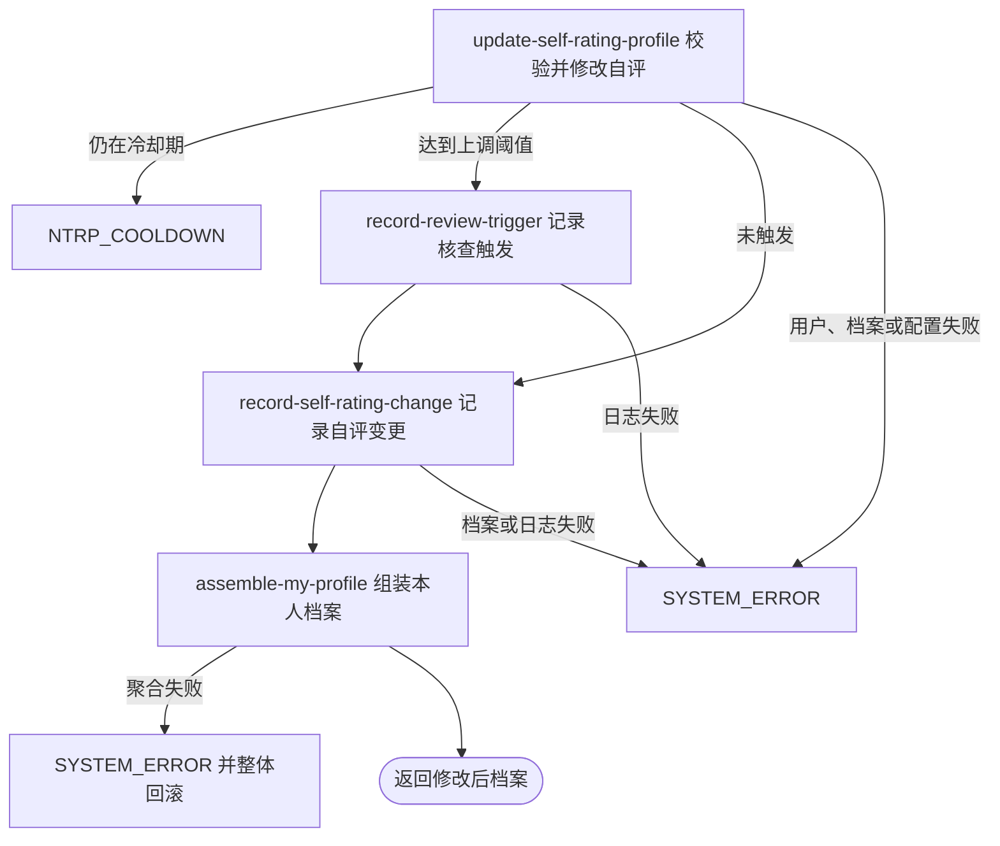

## 概要

修改本人 NTRP、记录变更并按涨幅触发核查期。

## 触发

登录用户手动修改本人 NTRP 自评时发起。一次请求处理一个目标值；同值提交也作为一次完整修改，写日志并刷新冷却起点。

## 接口契约

### 请求参数

| 字段 | 类型 | 必填 | 约束 |
|---|---|---|---|
| `ntrpScore` | 小数 | 是 | 1.5 至 7.0，且乘 2 后无余数，即步长 0.5 |

### 成功响应

返回与“我的档案”同结构的聚合结果。`TBC` 未触发核查时只返回状态与基础资料；`NORMAL` 或 `UNDER_REVIEW` 返回 NTRP、冷却或核查提示、评分、统计和视频。响应不交付日志、实际触发阈值或可靠的新核查剩余场次。

## 业务活动

- record-review-trigger  达到上调阈值时记录核查期触发日志
- update-self-rating-profile  校验冷却并更新 NTRP、修改时间与可选核查状态
- record-self-rating-change  记录本次 NTRP 前值、后值、差额与原因
- assemble-my-profile  组装修改后的本人聚合档案

## 流程图

## 详细流程

1. 接收 1.5 至 7.0 且为 0.5 倍数的 NTRP，识别当前用户并读取基础用户与网球档案；用户不存在按无效身份拒绝，无网球档案时无法修改且不补建。
2. 按 `ntrpUpdatedAt` 至当前时间的整日差计算冷却，可信度为空或小于 30 取低档，30 至 59 取中档，60 及以上取高档配置；尚未达到天数时返回剩余天数。整数配置无法解析按 0，可能跳过冷却。
3. 用新值减旧值计算差额；旧值为空时差额固定为 0。只有差额大于等于核查阈值才把状态、核查标记设为 `UNDER_REVIEW`/真并在内存设置所需剩余场次；降低、同值或小幅提高不触发，也不会解除既有核查期。
4. 触发时先保存一条 `UNDER_REVIEW` 变更日志，前后值都写所需场次、原因为用户、备注为自评向上修改触发核查期。
5. 将 NTRP 改为请求值并把修改时间刷新为当前时刻，保存档案的 NTRP、时间、状态和核查标记。当前仓储不写 `reviewRemainingMatches`，新设剩余场次不会持久化。
6. 保存一条 `NTRP` 变更日志，记录旧值、新值、差额和用户手动原因；同值修改也写零差额日志并重新开始冷却。
7. 在同一事务内聚合返回本人档案；`TBC` 只返回基础资料，其他状态返回等级、评分、统计与视频。日志、档案或聚合任一失败都会整体回滚。

## 异常分支

| 对外失败码 | 触发条件 | 由哪个活动报出 | 补偿动作或超时处理 | 对外提示 |
|---|---|---|---|---|
| 请求校验失败 | 值为空、小于 1.5、大于 7.0 或不是 0.5 步长 | 流程 | 不改档案、不写日志 | 使用对应 ntrpScore 校验提示 |
| `TOKEN_INVALID` | 当前登录身份没有基础用户 | update-self-rating-profile | 不创建用户或档案 | 登录凭证无效，请重新登录 |
| `NTRP_COOLDOWN` | 距上次修改的整日数小于当前可信度档位冷却天数 | update-self-rating-profile | 不改档案、不写日志 | 自评修改冷却中，N 天后可改 |
| `SYSTEM_ERROR` | 有用户但无网球档案，核查小数阈值配置非法或档案读取失败 | update-self-rating-profile | 事务回滚全部修改 | 系统异常，请稍后重试 |
| `SYSTEM_ERROR` | 核查触发日志、自评变更日志或档案更新失败 | 相应活动 | 事务回滚档案与两类日志 | 系统异常，请稍后重试 |
| `SYSTEM_ERROR` | 城市、统计、评分、视频、配置或资源签名聚合失败 | assemble-my-profile | 事务回滚档案与日志 | 系统异常，请稍后重试 |

降低、同值、小幅提高、`TBC` 或已有核查期都不是异常；只要冷却结束即可修改。整数配置非法时按 0 使用并可能使冷却或所需场次失效。

## 技术线索

- HTTP 接口：`PUT /user/profile/ntrp`
- 事务入口：`ProfileAppService.updateNtrp`
- 冷却分档：可信度 `<30`、`30-59`、`>=60`
- 核查触发：`newNtrp - oldNtrp >= score.review_period.trigger_ntrp_delta`
- 触发字段：`status=UNDER_REVIEW`、`is_under_review=true`
- 持久化缺口：仓储更新未包含 `review_remaining_matches`
- 日志类型：`UNDER_REVIEW`、`NTRP`；写入为大写枚举名
- 查询缺口：后续最新核查日志按小写 `under_review` 查询
- 修改时间：每次调用写 `ntrp_updated_at=now`
- 返回聚合：同步 `MyProfileAppService.getMyProfile`
