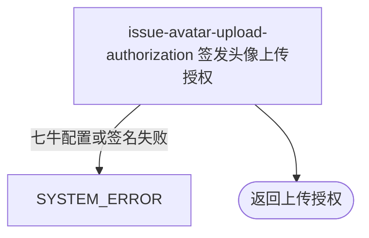

## 概要

签发本人固定头像位置的一小时七牛上传授权。

## 触发

登录用户准备直传一张新头像时发起；每次签发一个精确 key，同一秒重复请求复用位置。

## 接口契约

请求参数：无。成功返回 `uploadToken`、`key`、`maxSizeMb`、固定 `uploadHost`、预签名 `resourceUrl`；`keyPrefix=null`、`maxDurationSec=0`。

## 业务活动

- issue-avatar-upload-authorization  生成头像精确 key、上传策略、令牌与预览地址

## 流程图

## 详细流程

1. 识别当前登录用户，不读取或校验账户、网球档案和现有头像。
2. 读取头像最大 MB 配置；缺失使用枚举默认 5，非法整数按 0。以当前秒生成 `avatar/{userId}_{yyyyMMddHHmmss}.jpeg` 精确资源 key，同一用户同秒重复请求得到相同 key。
3. 生成只允许写该 key 且限制文件字节数的七牛策略；策略先写 600 秒截止值，再以 3600 秒有效期签发令牌，当前实际令牌期限按后者。
4. 返回令牌、key、大小上限、固定上传地址和预先生成的 3600 秒资源访问地址；不接收文件、不校验真实 JPEG、不保存 key 或删除旧头像。

## 异常分支

| 对外失败码 | 触发条件 | 由哪个活动报出 | 补偿动作或超时处理 | 对外提示 |
|---|---|---|---|---|
| `SYSTEM_ERROR` | 七牛桶、域名、凭据、令牌或访问地址签发失败 | issue-avatar-upload-authorization | 不保存授权或资源，无需补偿 | 系统异常，请稍后重试 |

账户或档案不存在、头像大小配置非法都不拒绝；非法整数按 0 MB 继续签发。

## 技术线索

- HTTP：`GET /user/upload/upload-token/avatar`
- key：`avatar/{userId}_{yyyyMMddHHmmss}.jpeg`
- 大小：`user.avatar.max_size_mb`
- scope：桶名加精确 key；`fsizeLimit=maxSizeMb*1024*1024`
- 令牌与资源地址：3600 秒；上传地址 `https://up-z0.qiniup.com`
