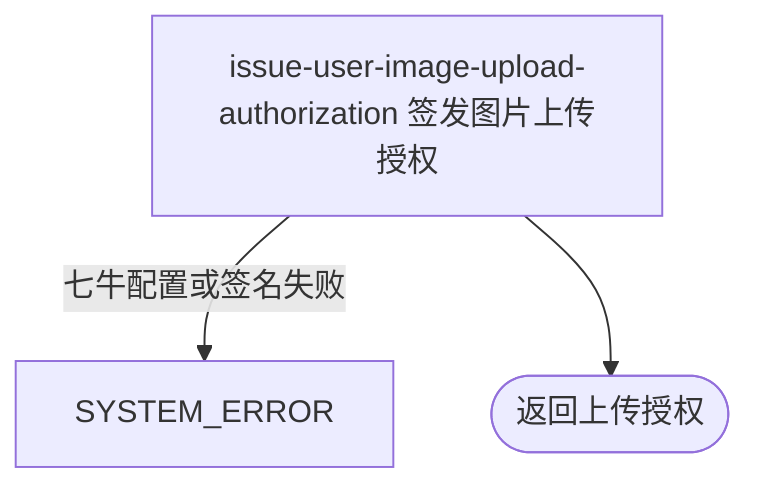

## 概要

按任意用途签发本人图片固定位置的一小时上传授权。

## 触发

登录用户为某个自行声明的图片用途申请直传授权时发起；一次请求签发一个精确 key，同秒同用途复用位置。

## 接口契约

请求查询参数：`type` 字符串，必填但可为空白或含路径字符。成功返回 `uploadToken`、`key`、`maxSizeMb=10`、`maxDurationSec=0`、`keyPrefix=null`、固定 `uploadHost` 与预签名 `resourceUrl`。

## 业务活动

- issue-user-image-upload-authorization  按原始用途生成图片 key、上传策略、令牌与预览地址

## 流程图

## 详细流程

1. 接收必填查询参数 `type` 并识别当前用户，不读取或校验账户、档案和已有资源。
2. 不校验 type 的空白、长度、枚举或路径字符，原样拼入 `user/{userId}/{type}_{yyyy-MM-dd_HH-mm-ss}.jpg`；同一用户同秒相同 type 得到相同 key。
3. 固定大小上限 10 MB，生成只允许写该精确 key 的七牛策略；策略先写 600 秒截止值，再以 3600 秒有效期签发令牌。
4. 返回令牌、key、10 MB、固定上传地址和预先生成的一小时资源访问地址；额外响应字段 `keyPrefix` 为空、`maxDurationSec` 为 0。
5. 不接收或验证图片，不保存资源用途和 key，不更新档案，也不清理旧文件。

## 异常分支

| 对外失败码 | 触发条件 | 由哪个活动报出 | 补偿动作或超时处理 | 对外提示 |
|---|---|---|---|---|
| 请求参数错误 | `type` 参数缺失 | 流程 | 不签发授权 | 按框架必填参数错误返回 |
| `SYSTEM_ERROR` | 七牛桶、域名、凭据、令牌或访问地址签发失败 | issue-user-image-upload-authorization | 不保存授权或资源，无需补偿 | 系统异常，请稍后重试 |

空白、未知、超长或含路径字符的 type，以及账户或档案不存在都不触发业务拒绝。

## 技术线索

- HTTP：`GET /user/upload/upload-token/user?type=...`
- key：`user/{userId}/{type}_{yyyy-MM-dd_HH-mm-ss}.jpg`
- 大小：固定 10 MB
- scope：桶名加精确 key；令牌与资源地址 3600 秒
- 上传地址：`https://up-z0.qiniup.com`
