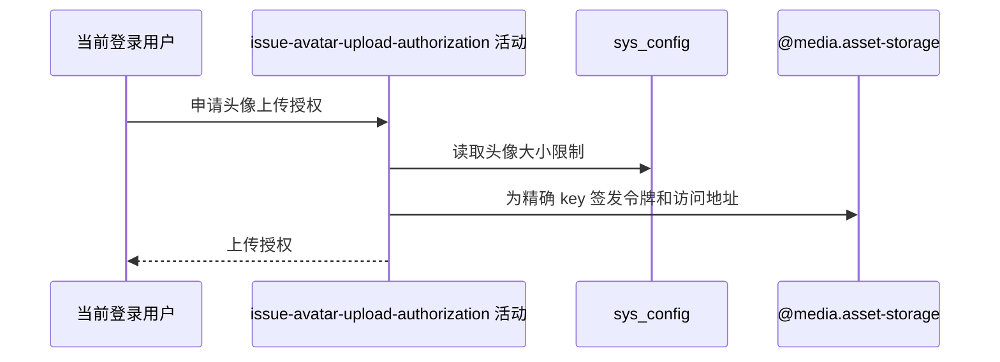

## 概要

生成本人头像精确 key、上传策略、七牛令牌与预签名预览地址。

## 时序图

## 触发条件

登录用户调用 `GET /user/upload/upload-token/avatar` 时执行。

## 活动契约

无业务入参；返回精确头像 key、令牌、大小上限、固定上传地址和一小时资源地址，`keyPrefix=null`、`maxDurationSec=0`。不落库。

## 异常分支

| 错误标识 | 触发条件 | 处理 |
|---|---|---|
| `SYSTEM_ERROR` | 七牛桶、域名、凭据、令牌或访问地址生成失败 | 不保存授权或资源 |

## 领域依赖

### @media.asset-storage

- 输入：精确 key、大小限制与一小时授权意图
- 输出：七牛上传令牌和预签名访问地址，或签发失败

## 业务动作

A1 读取头像大小限制
A2 生成秒级精确 key
A3 签发上传令牌与预览地址

## 详细流程

1. 只取得登录用户编号，不读取账户、档案或现有头像。
2. `A1` 读取 `user.avatar.max_size_mb`，缺失用默认 5，非法整数按 0。
3. `A2` 生成 `avatar/{userId}_{yyyyMMddHHmmss}.jpeg`；同一用户同秒请求得到相同 key。
4. `A3` 策略 scope 限定精确 key，写入字节上限和 600 秒 deadline，再以 3600 秒签发；返回固定上传 host 与 3600 秒资源地址。
5. 不接收文件、不验证 JPEG、不保存 key，也不删除旧头像。

## 边界情况

- 配置为 0 仍签发 0 MB 限制令牌。
- 同秒授权可能覆盖同一资源位置。
- 资源地址可以在实际上传前生成，不代表文件存在。

## 实现提示

配置读列按 DB snapshot 声明；授权本身不持久化，七牛能力通过 `@media.asset-storage` 表达。RPC snapshot 当前缺失。
