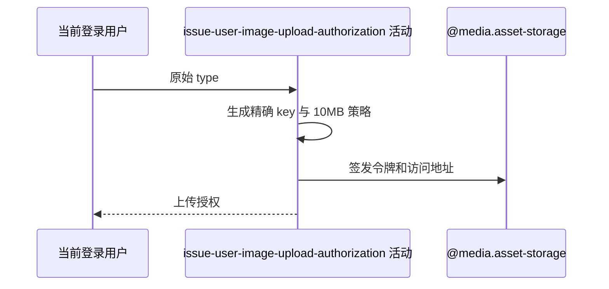

## 概要

按原始用途生成本人图片精确 key、上传策略、令牌与预览地址。

## 时序图

## 触发条件

调用 `GET /user/upload/upload-token/user` 且必填查询参数 type 已由框架取得后执行。

## 活动契约

入参为当前用户和原始 type；返回精确图片 key、令牌、固定 10MB、固定上传地址和一小时资源地址，`keyPrefix=null`、`maxDurationSec=0`。不落库。

## 异常分支

| 错误标识 | 触发条件 | 处理 |
|---|---|---|
| 请求参数错误 | type 缺失 | 不进入活动 |
| `SYSTEM_ERROR` | 七牛配置、令牌或地址生成失败 | 不保存授权或资源 |

## 领域依赖

### @media.asset-storage

- 输入：精确图片 key、10MB 限制与一小时授权意图
- 输出：上传令牌和预签名地址，或失败

## 业务动作

A1 原样拼接用途与秒级 key
A2 构造精确上传策略
A3 签发令牌与预览地址

## 详细流程

1. 不读取账户、档案或已有资源；type 不校验空白、长度、枚举或路径字符。
2. `A1` 生成 `user/{userId}/{type}_{yyyy-MM-dd_HH-mm-ss}.jpg`，同用户同秒同 type 复用位置。
3. `A2-A3` 固定 10MB，scope 限定精确 key；策略写 600 秒 deadline，再以 3600 秒签发令牌和资源地址。
4. 不接收或验证图片，不保存用途/key，不更新档案或清理旧文件。

## 边界情况

- 空白、未知、超长或含 `/`、`..` 的 type 均原样进入 key。
- 预览地址不证明文件已上传。
- `key` 与 `resourceUrl` 返回，前缀字段为空。

## 实现提示

活动无数据库读取与持久化，`reads` 为空；七牛授权通过 `@media.asset-storage` 表达，RPC snapshot 当前缺失。
