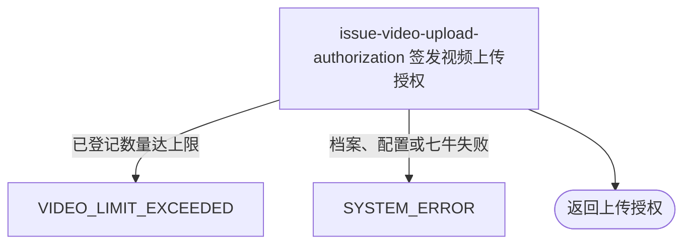

## 概要

核对已登记数量并签发本人视频的一小时上传授权。

## 触发

登录用户准备向七牛上传档案视频前发起。每次只签发凭证，不预占登记名额；重复或并发申请可获得多份有效授权。

## 接口契约

请求参数：无。

成功返回 `uploadToken`、`keyPrefix=videos/{userId}/`、配置所得 `maxSizeMb`、`maxDurationSec=60`、`uploadHost=https://up-z0.qiniup.com`；`key` 与 `resourceUrl` 为 `null`。`keyPrefix` 是客户端建议，不代表令牌最终 scope 已受该前缀限制。

## 业务活动

- issue-video-upload-authorization  核对已登记数量并签发七牛上传令牌与建议前缀

## 流程图

## 详细流程

1. 识别当前用户，只按用户编号查询可选网球档案；不校验基础账户，也不自动建档。
2. 档案存在且视频列表非空时读取数量上限，列表条数大于等于上限即拒绝。无档案、列表为 `null` 或空列表时跳过数量判断；已上传未登记文件不计数，签发授权也不占名额。
3. 数量配置非法整数按 0：非空列表会被判已达上限，空列表或无档案仍继续。读取单文件大小配置，非法整数按 0 MB。
4. 构造建议前缀 `videos/{userId}/` 并先写前缀 scope、大小限制和 600 秒截止；随后调用七牛 SDK 以桶名、空 key、3600 秒签发，当前最终 scope 变为整个桶、deadline 为一小时，而大小限制保留。
5. 返回令牌、建议 key 前缀、大小上限、固定 60 秒时长说明和固定上传地址；`key`、`resourceUrl` 为空。授权未包含视频时长、媒体类型、扩展名或内容限制。
6. 不接收文件、不确认上传、不登记视频、不持久化授权，也不改变档案状态。

## 异常分支

| 对外失败码 | 触发条件 | 由哪个活动报出 | 补偿动作或超时处理 | 对外提示 |
|---|---|---|---|---|
| `VIDEO_LIMIT_EXCEEDED` | 档案视频列表非空且条目数大于等于当前数量上限 | issue-video-upload-authorization | 不签发本次令牌；不修改档案 | 视频数量已达上限 |
| `SYSTEM_ERROR` | 档案视频 JSON 无法解析或查询失败 | issue-video-upload-authorization | 不修改档案 | 系统异常，请稍后重试 |
| `SYSTEM_ERROR` | 七牛桶、凭据或令牌签发失败 | issue-video-upload-authorization | 不持久化授权，无需业务补偿 | 系统异常，请稍后重试 |

无账户或网球档案、空视频列表、未登记文件和已有未使用令牌都不拒绝。整数配置非法按 0；可能导致非空列表被拒绝或签出 0 MB 授权。

## 技术线索

- HTTP：`GET /user/upload/upload-token/video`
- 数量配置：`user.video.max_count`
- 大小配置：`user.video.max_size_mb`
- 建议前缀：`videos/{userId}/`
- 初始策略：前缀 scope、`isPrefixalScope=1`、`fsizeLimit`、600 秒 deadline
- 最终签发：`uploadToken(bucket, null, 3600, policy)`，scope 为桶、期限 3600 秒
- 时长：响应固定 60，未进入策略
