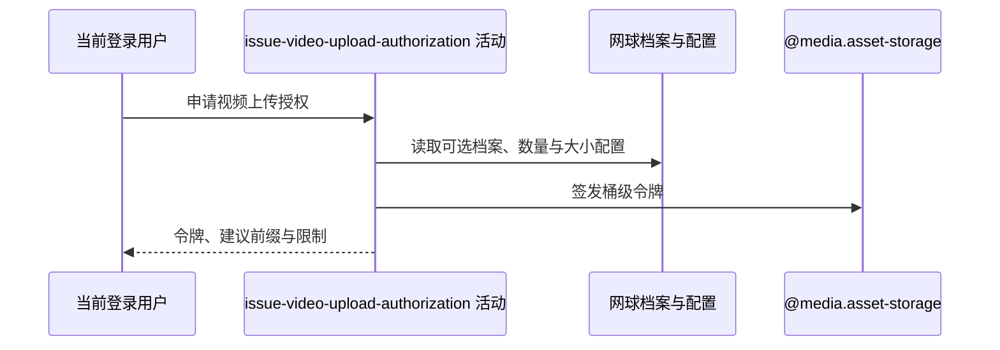

## 概要

核对本人已登记视频数量，签发七牛上传令牌与建议视频目录前缀。

## 时序图

## 触发条件

登录用户调用 `GET /user/upload/upload-token/video` 时执行。

## 活动契约

无业务入参；在已登记数量未达上限时返回令牌、`videos/{userId}/` 建议前缀、大小限制、固定 60 秒说明和上传地址。`key/resourceUrl=null`，不预占名额、不落库。

## 异常分支

| 错误标识 | 触发条件 | 处理 |
|---|---|---|
| `VIDEO_LIMIT_EXCEEDED` | 非空视频列表条数大于等于数量上限 | 不签发本次令牌 |
| `SYSTEM_ERROR` | 档案 JSON、配置、七牛凭据或令牌签发失败 | 不修改档案 |

## 领域依赖

### @media.asset-storage

- 输入：桶、大小限制与一小时上传授权意图
- 输出：上传令牌，或签发失败

## 业务动作

A1 核对已登记视频数量
A2 读取单文件大小限制
A3 构造策略并签发令牌

## 详细流程

1. 按登录用户编号读取可选网球档案，不校验基础账户、不建档。
2. `A1` 仅档案存在且 videos 非空时读取数量上限并比较 `size >= maxCount`；无档案/null/空列表跳过。未登记文件和已签令牌不计数。
3. 数量配置非法按 0，非空列表会被拒绝；`A2` 大小配置非法按 0MB。
4. `A3` 初始策略写前缀 scope、`isPrefixalScope=1`、字节限制和 600 秒 deadline；随后 SDK 以 bucket、null key、3600 秒签发，最终 scope 变为整个桶、deadline 为一小时，大小限制保留。
5. 返回建议前缀、固定 60 秒与上传 host；策略不限制时长、媒体类型、扩展名或内容，不登记视频。

## 边界情况

- 重复或并发申请可得到多份有效令牌，不占登记名额。
- 无账户或档案仍可签发。
- 返回的 keyPrefix 是建议，当前最终令牌 scope 并未受它限制。

## 实现提示

档案和配置读列按 DB snapshot 声明；令牌不持久化，七牛能力通过 `@media.asset-storage` 表达。RPC snapshot 当前缺失。
