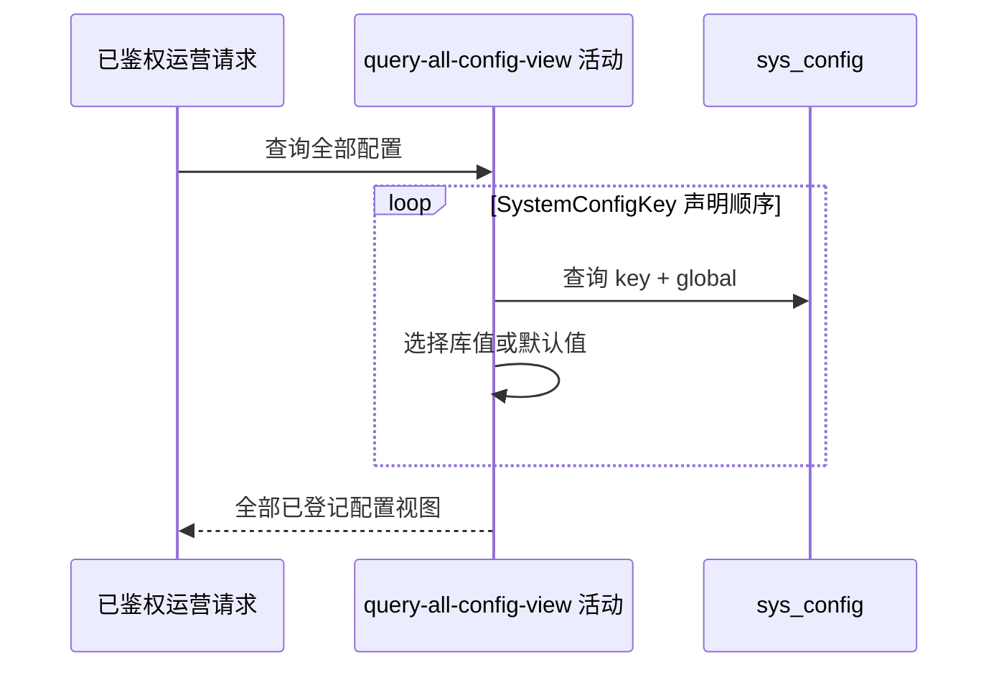

## 概要

按已注册配置名录组装全部配置的当前值、默认值、版本和覆盖状态。

## 时序图

## 触发条件

`GET /system/admin/config` 已通过 `X-Admin-Key` 鉴权后执行。

## 活动契约

无业务入参；按枚举声明顺序返回全部已注册配置的 key、说明、当前值、默认值、版本和 overridden，不分页、不筛选。活动只读。

## 异常分支

| 错误标识 | 触发条件 | 处理 |
|---|---|---|
| `SYSTEM_ERROR` | 任一配置查询或结果组装失败 | 终止整体查询，不返回部分列表 |

## 领域依赖

无

## 业务动作

A1 遍历已注册配置名录
A2 查询 global 配置记录
A3 选择生效值并组装元数据

## 详细流程

1. `A1` 按 `SystemConfigKey.values()` 声明顺序动态遍历当前全部正式配置项；数据库中未注册的 key 不返回。
2. `A2` 每项按 `config_key + scope=global` 唯一查询。
3. `A3` 记录存在且 enabled=true 时原样使用库值并标记 overridden=true；不存在或停用时使用枚举默认值并标记 false。
4. 记录不存在时 version=0；记录存在时返回库内版本，即使停用。说明和默认值始终来自枚举。
5. 不解析、校验、归一化或修复配置值，完整组装后一次返回。

## 边界情况

- 已启用但内容非法的值仍原样展示。
- 停用记录使用默认值，但仍暴露其库内版本。
- 已注册项数量随正式配置名录动态变化，不承诺固定数量。

## 实现提示

只读列按当前 DB snapshot 精确声明；运营鉴权属于流程入口，不在本活动重复校验。
