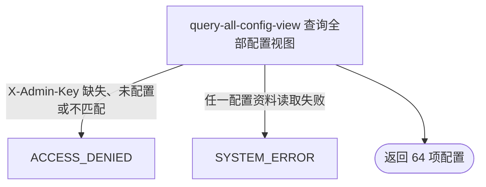

## 概要

向运营后台返回全部已注册系统配置及其当前生效值、默认值和版本信息。

## 触发

运营后台需要查看平台当前全部已登记配置时发起。请求必须携带有效的运营访问凭据，不要求用户登录态。

## 接口契约

请求参数：无。请求头必须包含 `X-Admin-Key`。

成功返回 `configs` 列表，固定按已登记配置的声明顺序包含 64 项。每项包含 `key`、`description`、`configValue`、`defaultValue`、`version` 和 `overridden`。不支持过滤、分页或指定作用域。

## 业务活动

- query-all-config-view  组装并交付全部已登记配置的当前全量视图

## 流程图

## 详细流程

1. 请求先经过运营后台接口鉴权；只有服务端已配置且请求携带与之一致的 `X-Admin-Key` 才继续，不依赖用户登录态。
2. 按 `SystemConfigKey` 枚举声明顺序遍历全部 64 个已注册配置；数据库中不在枚举内的配置不进入结果。
3. 对每个配置键查询 `scope=global` 的唯一记录。已启用记录使用库内 `configValue`，并标记 `overridden=true`；记录不存在或已停用时回退枚举默认值，并标记 `overridden=false`。
4. `version` 在记录不存在时为 0；只要记录存在就返回其库内版本，即使记录已停用。每项同时返回枚举中的键、说明和默认值。
5. 查询不解析、校验或归一化库内配置值，也不修复无效值；组装完成后一次性返回 `configs` 列表，不产生任何持久化变更。

## 异常分支

| 对外失败码 | 触发条件 | 由哪个活动报出 | 补偿动作或超时处理 | 对外提示 |
|---|---|---|---|---|
| `ACCESS_DENIED` | 服务端未配置运营密钥，或请求头 `X-Admin-Key` 缺失、空白或不匹配 | 流程入口鉴权 | 未开始配置查询，无需补偿 | 无权限访问 |
| `SYSTEM_ERROR` | 任一已登记配置的数据库查询或结果组装失败 | query-all-config-view | 终止整体查询，不返回部分列表；本流程只读，无需补偿 | 系统异常，请稍后重试 |

配置记录不存在、已停用，或已启用但值与登记用途不相符，均不会使查询失败；前两者回退默认值，后者仍原样返回库值。

## 技术线索

- HTTP：`GET /system/admin/config`
- 鉴权范围：`/system/admin/**`，请求头 `X-Admin-Key`，服务端配置 `admin.api-key`
- 配置名录：`SystemConfigKey.values()`，当前 64 项
- 持久化：`sys_config`，唯一键 `(config_key, scope)`，本流程只查询 `scope=global`
- 组装：`HomeConfigAdminAppService.getAll()` / `buildItem()`
- 响应：`HomeConfigDTO.configs` 与 `HomeConfigItemDTO`
