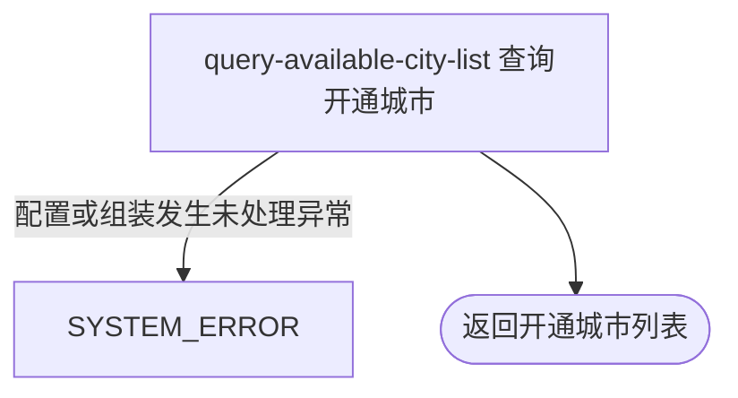

## 概要

向用户或匿名访问者交付当前已开通城市的基础资料列表。

## 触发

用户或匿名访问者需要获取当前业务已开通城市时发起。

## 接口契约

请求参数：无。用户身份可选，不影响结果。

成功返回城市数组，每个有效城市项包含 `code`、`name`、`initials` 和 `pinyin`。不支持分页或排序参数，列表顺序不承诺稳定；空白或未知配置编码可导致数组中包含 `null` 项。

## 业务活动

- query-available-city-list  按当前开通编码组装城市资料列表

## 流程图

## 详细流程

1. 接收无参数查询；接口支持可选登录态，匿名和已登录请求使用相同查询口径。
2. 读取内存中当前生效的 `meetup.city.opened_codes` 字符串；没有启用覆盖值时使用默认值 `330100,330200`。
3. 仅以半角逗号分割配置值，不裁剪空白、不校验格式；随后转为去重集合，因此重复编码只返回一项，迭代顺序不构成稳定承诺。
4. 按每个编码直接从启动时载入的城市名录缓存取得资料。编码含空白或名录中不存在时不过滤，对应位置保留为 `null`。
5. 将非空城市资料映射为 `code`、`name`、`initials` 和 `pinyin`，返回整个列表；查询不修改城市名录或开通配置。

## 异常分支

| 对外失败码 | 触发条件 | 由哪个活动报出 | 补偿动作或超时处理 | 对外提示 |
|---|---|---|---|---|
| `SYSTEM_ERROR` | 配置缓存读取、集合构造或 DTO 组装出现未处理异常 | query-available-city-list | 终止查询；本流程只读，无需补偿 | 系统异常，请稍后重试 |

没有启用覆盖值时使用默认城市并正常返回。空配置、含空白或未知编码以及城市名录缓存为空都不会主动报错，可能返回包含 `null` 的列表。若配置字符串分割本身发生异常，则按空编码集合返回空列表。

## 技术线索

- HTTP：`GET /city/available`，`@OptionalAuth`
- 配置：`meetup.city.opened_codes`，默认 `330100,330200`
- 配置读取：`SystemConfig.getString()` / `CityConfig.getOpenedCities()`
- 去重与名录映射：`Set.copyOf(...)` / `CityConfig.cities.get(code)`
- 应用组装：`CityAppService.listAvailable()` / `CityAppConvertMapper`
