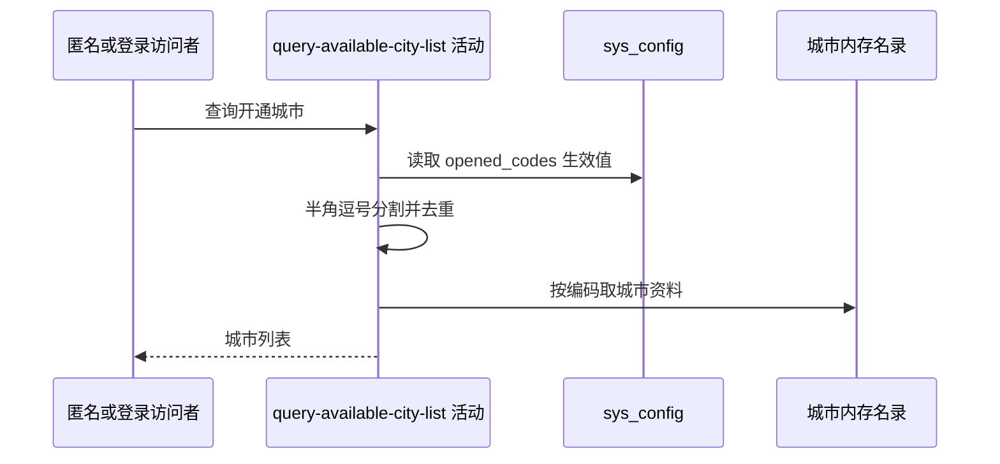

## 概要

按当前开通城市编码，从启动时内存名录组装城市资料列表。

## 时序图

## 触发条件

调用 `GET /city/available` 时执行，匿名和登录请求相同。

## 活动契约

无业务入参；返回当前开通编码对应的 `code/name/initials/pinyin` 列表，不分页且不保证顺序。活动只读。

## 异常分支

| 错误标识 | 触发条件 | 处理 |
|---|---|---|
| `SYSTEM_ERROR` | 配置缓存、集合构造或 DTO 组装未处理异常 | 终止查询 |

## 领域依赖

无

## 业务动作

A1 读取开通编码配置
A2 分割去重编码
A3 从内存名录映射城市资料

## 详细流程

1. `A1` 读取 `meetup.city.opened_codes`；无启用覆盖时用默认 `330100,330200`。
2. `A2` 仅以半角逗号分割，不 trim、不校验格式，再转去重集合；迭代顺序不稳定。
3. `A3` 对每个编码直接查启动时城市缓存；空白或未知编码不过滤，对应结果保留 null。
4. 非空城市映射四个字段后返回，不修改配置或名录。

## 边界情况

- 重复编码只返回一项。
- 空配置、空白或未知编码可能产生空列表或 null 项。
- 城市资源启动加载失败时名录可为空而不主动报业务错误。

## 实现提示

配置读列按 DB snapshot 声明；城市资料来源为随包 `city.json` 的内存缓存，不对应数据库表。
