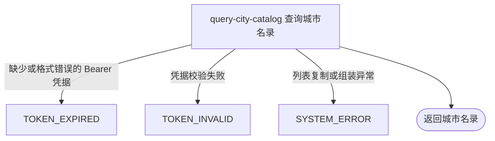

## 概要

向已登录用户交付平台当前能够识别的全部城市资料。

## 触发

已登录用户需要查看平台能够识别的完整城市名录时发起。

## 接口契约

请求参数：无。请求头必须包含有效的 `Authorization: Bearer <token>`。

成功返回城市数组，每项包含 `code`、`name`、`initials` 和 `pinyin`。当前随包名录有 337 项，具体数量以当次发布的 `city.json` 为准。不支持筛选、搜索、分页或排序，返回顺序不作稳定承诺。

## 业务活动

- query-city-catalog  从内存名录组装并交付全部可识别城市

## 流程图

## 详细流程

1. 识别当前登录用户；该路径未标记可选鉴权，匿名请求在进入城市查询前被拒绝。用户身份不参与后续列表筛选。
2. 读取应用启动时从 `city.json` 载入并按城市编码索引的内存名录，将其全部 `values` 复制为列表。
3. 名录索引使用普通映射，因此返回顺序不承诺与资源文件或任何业务顺序一致；不支持筛选、搜索、分页或排序。
4. 将每座城市原样映射为 `code`、`name`、`initials` 和 `pinyin` 后返回。名录资源无法读取或解析时，启动加载将其降级为空映射，本查询因而正常返回空列表。
5. 本流程不读取开通城市配置，不区分已开通与未开通城市，也不修改名录。

## 异常分支

| 对外失败码 | 触发条件 | 由哪个活动报出 | 补偿动作或超时处理 | 对外提示 |
|---|---|---|---|---|
| `TOKEN_EXPIRED` | `Authorization` 缺失、空白或不以 `Bearer ` 开头 | 流程入口鉴权 | 未开始名录查询，无需补偿 | 登录已过期，请重新登录 |
| `TOKEN_INVALID` | Bearer 令牌无法通过校验 | 流程入口鉴权 | 未开始名录查询，无需补偿 | 令牌无效 |
| `SYSTEM_ERROR` | 内存列表复制或 DTO 组装出现未处理异常 | query-city-catalog | 终止查询；本流程只读，无需补偿 | 系统异常，请稍后重试 |

`city.json` 在应用启动时读取或解析失败会被记录日志并降级成空名录；此后调用本接口正常返回空数组，不对外报错。

## 技术线索

- HTTP：`GET /city`，需普通 Bearer 鉴权
- 资源：`rally-infrastructure/src/main/resources/city.json`，当前 337 项
- 启动加载：`ResourceConfigLoader.city()` / `SysConfigLoaderImpl.city()`
- 内存名录：`CityConfig.cities`，查询入口 `CityConfig.allCity()`
- 应用组装：`CityAppService.listAll()` / `CityAppConvertMapper`
