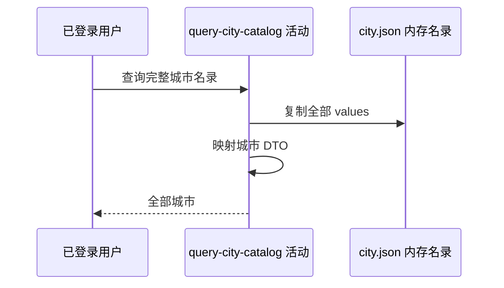

## 概要

从启动时城市内存名录组装并交付全部可识别城市。

## 时序图

## 触发条件

`GET /city` 通过普通 Bearer 鉴权后执行。

## 活动契约

无业务入参；返回全部内存城市的 `code/name/initials/pinyin`，不筛选、不分页且不保证顺序。活动只读。

## 异常分支

| 错误标识 | 触发条件 | 处理 |
|---|---|---|
| `SYSTEM_ERROR` | 内存列表复制或 DTO 组装出现未处理异常 | 终止查询 |

## 领域依赖

无

## 业务动作

A1 复制全部城市名录
A2 映射城市公开字段

## 详细流程

1. 鉴权在流程入口完成，登录用户身份不参与筛选。
2. `A1` 复制应用启动时从 `city.json` 按编码建立的普通映射全部 values。
3. 普通映射迭代顺序不承诺与资源文件或业务排序一致。
4. `A2` 原样映射四个字段后返回；不读取开通城市配置，也不修改名录。
5. 资源读取或解析若在启动时失败会降级为空映射，本查询正常返回空列表。

## 边界情况

- 当前随包资源为 337 项，数量随发布资源变化。
- 空名录不是接口业务异常。
- 本活动没有数据库读取，`reads` 保持为空。

## 实现提示

数据源是 `rally-infrastructure/src/main/resources/city.json` 的启动缓存；鉴权错误由流程入口负责。
