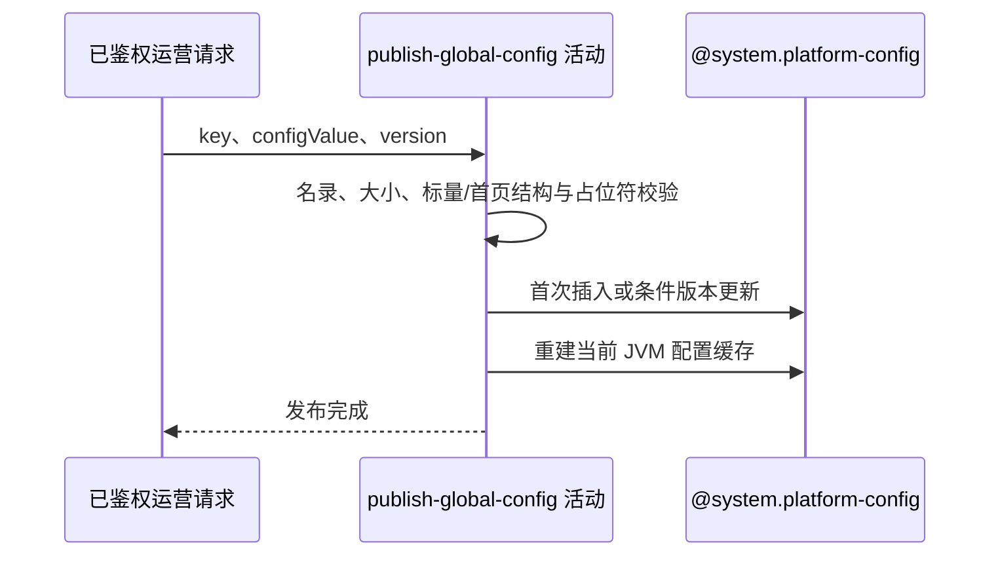

## 概要

校验一项已登记配置内容，以乐观版本发布并刷新当前进程配置缓存。

## 时序图

## 触发条件

`POST /system/admin/config/update` 已通过运营密钥与请求必填校验后执行；提交的 key 尚未在活动内完成名录确认。

## 活动契约

入参：

| 字段 | 类型 | 必填 | 约束 |
|---|---|---|---|
| key | 字符串 | 是 | 非空白，必须在当前配置名录中 |
| configValue | 字符串 | 是 | 最多 100000 个 Java 字符；内容规则由 key 决定 |
| version | 整数 | 是 | 首次发布为 0，已有记录精确匹配库内版本 |

成功返回：

| 字段 | 类型 | 说明 |
|---|---|---|
| published | 布尔 | 固定为 true，表示已发布 enabled 全局值并刷新当前进程缓存 |

## 异常分支

| 错误标识 | 触发条件 | 来源 |
|---|---|---|
| `PARAM_ERROR` | 未知 key、超长、标量或完整首页 JSON 校验失败 | update-global-config `PARAM_ERROR` |
| `OPERATION_FAILED` | 首次版本非 0、条件更新未命中或保存失败 | update-global-config `OPERATION_FAILED` |
| `SYSTEM_ERROR` | 数据库约束、缓存刷新或提交异常 | update-global-config `SYSTEM_ERROR` |

## 领域依赖

### @system.platform-config

- 输入：配置键、规范化值、版本、说明、类型与启用意图
- 输出：首次版本 1 或匹配版本加一，并刷新当前实例缓存；冲突或失败返回结论

## 业务动作

A1 按当前名录校验并规范化配置内容
A2 首次插入或乐观版本更新
A3 重建当前 JVM 配置缓存

## 详细流程

1. `A1` key 必须在 `SystemConfigKey`；拒绝超过 100000 个 Java 字符的内容。`home.layout.config`、`home.tournament.poster.config`、`home.poster.config` 已退出名录，按未知 key 拒绝。
2. `home.page.config` 必须是包含 `sections` 数组的根对象。区域 `id` 和 `type` 必填，`enabled` 可选布尔且缺省为 true；类型限于 `MEETUP`、`TOUR_MATCH`、`POSTER`、`NEWS`，除 `POSTER` 外同类最多一个。
3. `POSTER` 区域的 `title` 必须为非空字符串，`subtitle` 可选字符串，`posters` 必须是数组；区块 `cityId` 可缺失、为 null 或空白，非空时必须是字符串但不查询城市名录。旧 `cityAware` 不再作为已识别字段。单张海报的 `actionType` 和 `image` 必须为非空字符串，交互方式限于 `NAVIGATE` 或 `PREVIEW`；`title`、`subtitle` 和三端 URL 可选，出现时必须是字符串，单张海报上的旧 `cityId` 不再作为已识别字段。
4. 只扫描 `wechatUrl`、`appUrl`、`webUrl` 中的导航占位符：允许任意次出现 `{{cityCode}}` 与 `{{cityName}}`，旧 `{{cityId}}` 和其他 `{{...}}`、空占位符、未闭合 `{{` 或无配对 `}}` 均复用无效占位符 `PARAM_ERROR`。两个已登记占位符原样保存，不在发布时替换或查询城市；其他字段中的大括号按普通文本处理。
5. 根对象、区域和海报中的未识别字段原样保留，旧 `cityAware` 因此可保留但无规则效果；已识别字段严格校验后，将整份配置紧凑序列化。其他配置按默认值形式推断整数/小数校验，字符串不规范化。
6. `A2` 查询 global 记录。不存在仅接受 version=0，创建、推断 valueType、enabled=true、version=1。
7. 已存在时只恢复并校验发布所需的持久化身份、`valueType` 和版本，不按当前名录重新校验即将被替换的旧内容；再以 `id + 提交version` 条件更新为已通过当前规则的新值、当前说明、enabled=true、version+1，不重写既有 valueType。未命中视并发冲突。
8. `A3` 同一事务内清空并从全部 enabled 记录重建当前 JVM 缓存，不通知其他实例。旧首页 key 的历史记录保留在库内，但没有业务读取方会再消费它们。
9. 后续读取或事务提交失败会回滚数据库，但已改进程缓存不会随事务补偿。

## 边界情况

- 应用允许 100000 字符，但表列仅 VARCHAR(2048)，可在数据库阶段失败。
- 空字符串是否有效由推断类型决定；普通字符串允许。
- `home.page.config.sections` 可为空数组；`POSTER.posters` 也可为空数组。
- 区块 `cityId` 非空时不校验城市名录；错误或已停用城市会使整个海报区块无法匹配。单张海报上的旧 `cityId` 作为未知字段保留但不产生可见性效果。
- 导航 URL 没有占位符时原样保存；`{{cityCode}}` 与 `{{cityName}}` 可重复出现，运行时替换规则不属于本活动。
- 内置默认地图和球场搜索 URL 使用 `cityCode={{cityCode}}&cityName={{cityName}}&mode=view`。
- 名录规则升级后，已有值即使不再符合当前内容规则，也可以由通过当前规则的新值覆盖；旧记录身份、valueType 和版本仍必须有效。
- `cityAware` 可作为未知字段留在已保存 JSON 中，但不参与校验或导航行为。
- 未识别 JSON 字段允许并保留，但不影响已识别字段校验。
- 缓存与数据库可因事务后失败暂时不一致，多实例也不会同步刷新。

## 实现提示

配置写入通过 `@system.platform-config` 表达，`reads` 为空；当前实现是数据库事务与 JVM 缓存的非原子组合。
