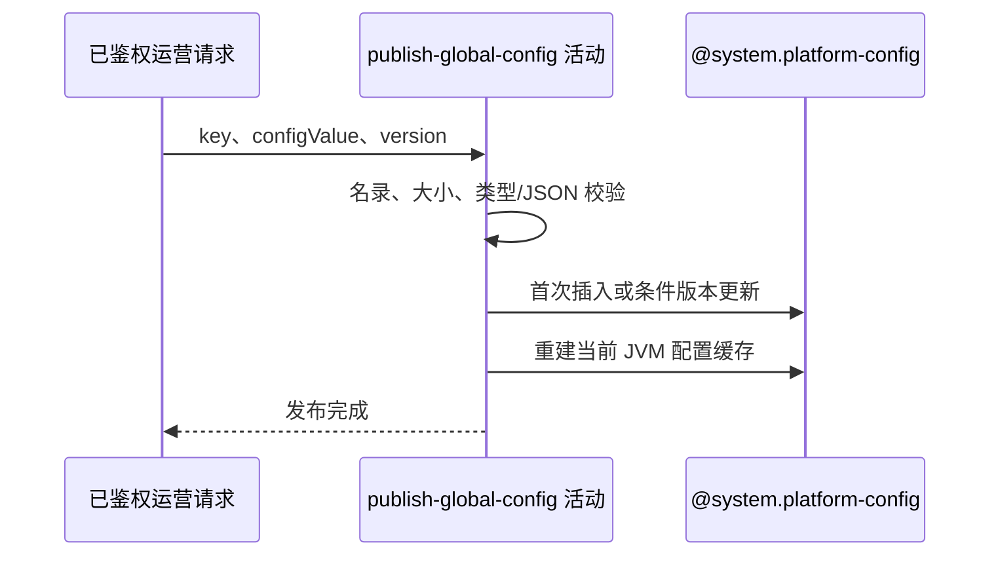

## 概要

校验一项已登记配置内容，以乐观版本发布并刷新当前进程配置缓存。

## 时序图

## 触发条件

`POST /system/admin/config/update` 已通过运营密钥与请求必填校验后执行。

## 活动契约

入参为已登记 key、非 null 字符串值和提交版本；首次发布要求版本 0，已有记录要求精确匹配。成功发布 enabled 全局值并刷新当前进程缓存。

## 异常分支

| 错误标识 | 触发条件 | 处理 |
|---|---|---|
| `PARAM_ERROR` | 未知 key、超长、标量或首页 JSON 校验失败 | 不写配置 |
| `OPERATION_FAILED` | 首次版本非 0、条件更新未命中或保存失败 | 回滚数据库事务 |
| `SYSTEM_ERROR` | 数据库约束、缓存刷新或提交异常 | 回滚数据库；进程缓存无事务补偿 |

## 领域依赖

### @system.platform-config

- 输入：配置键、规范化值、版本、说明、类型与启用意图
- 输出：首次版本 1 或匹配版本加一，并刷新当前实例缓存；冲突或失败返回结论

## 业务动作

A1 校验并规范化配置内容
A2 首次插入或乐观版本更新
A3 重建当前 JVM 配置缓存

## 详细流程

1. `A1` key 必须在 `SystemConfigKey`；拒绝超过 100000 个 Java 字符的内容。
2. 首页三类 JSON 按结构、数量、类型、必填文本校验后紧凑序列化；其他值按默认值形式推断整数/小数校验，字符串不规范化。
3. `A2` 查询 global 记录。不存在仅接受 version=0，创建、推断 valueType、enabled=true、version=1。
4. 已存在时以 `id + 提交version` 条件更新值、当前说明、enabled=true、version+1；不重写既有 valueType。未命中视并发冲突。
5. `A3` 同一事务内清空并从全部 enabled 记录重建当前 JVM 缓存，不通知其他实例。
6. 后续读取或事务提交失败会回滚数据库，但已改进程缓存不会随事务补偿。

## 边界情况

- 应用允许 100000 字符，但表列仅 VARCHAR(2048)，可在数据库阶段失败。
- 空字符串是否有效由推断类型决定；普通字符串允许。
- 缓存与数据库可因事务后失败暂时不一致，多实例也不会同步刷新。

## 实现提示

配置写入通过 `@system.platform-config` 表达，`reads` 为空；当前实现是数据库事务与 JVM 缓存的非原子组合。
