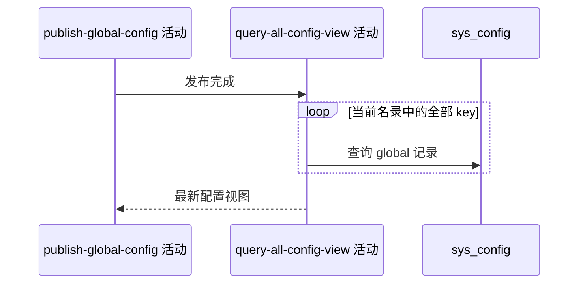

## 概要

发布后按已登记名录重读并交付最新全部配置视图。

## 时序图

## 触发条件

配置发布与当前实例缓存重建成功后、事务提交前执行。

## 活动契约

入参：

无。

成功返回：

| 字段 | 类型 | 说明 |
|---|---|---|
| configs | 配置视图数组 | 按当前名录声明顺序返回全部配置的当前值、默认值、版本和覆盖状态 |

## 异常分支

| 错误标识 | 触发条件 | 来源 |
|---|---|---|
| `SYSTEM_ERROR` | 任一配置读取或组装失败 | update-global-config `SYSTEM_ERROR` |

## 领域依赖

无

## 业务动作

A1 遍历已登记配置
A2 读取 global 记录
A3 选择生效值并组装视图

## 详细流程

1. 按 `SystemConfigKey` 当前声明顺序遍历全部已登记 key，返回数量随当前名录变化，不写死具体数字。
2. 每项按 key/global 查询；enabled 记录用库值且 overridden=true，否则用默认值且 false。
3. 无记录 version=0，有记录返回库内版本，即使停用。
4. `home.page.config` 无记录时返回完整默认首页 JSON、version=0、overridden=false；记录停用时返回完整默认首页 JSON、库内 version 和 overridden=false。
5. 数据库中的旧首页 key 或其他未登记记录全部忽略，不返回、删除、停用或报错。
6. 完整组装后返回；不解析或修复值。查询失败向上传播并回滚数据库发布。

## 边界情况

- 本次更新项应显示加一后的版本与 overridden=true。
- `home.page.config` 与其他已登记配置使用完全相同的视图选择口径。
- 缓存已重建但本活动失败时，数据库会回滚而缓存可能保留未提交值。
- 返回项数随配置枚举变化。

## 实现提示

只读列按当前 DB snapshot 声明；本活动与独立全量查询共享口径，但处于写事务内。
