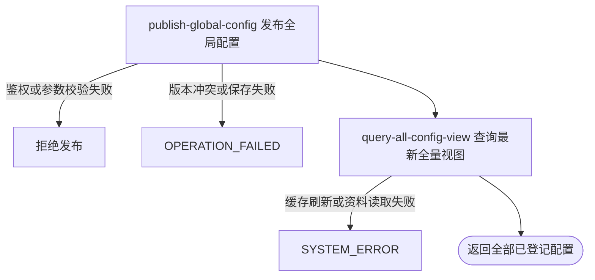

## 概要

校验并发布一项已登记的全局配置新版本，然后交付更新后的全部配置视图。

## 触发

运营后台需要首次发布、重新启用或更新一项已登记全局配置时发起。调用方必须持有有效运营密钥，并提交自己所见的配置版本。

## 接口契约

请求头：`X-Admin-Key` 必填且必须与服务端 `admin.api-key` 匹配。

请求体包含：

- `key`：非空白的已登记配置键。
- `configValue`：非 `null` 的字符串；是否允许空串取决于后续类型校验。
- `version`：非 `null` 整数；首次发布必须为 0，已有记录必须与保存版本一致。

成功返回 `configs` 列表，按已登记顺序包含更新后的全部配置；每项包含 `key`、`description`、`configValue`、`defaultValue`、`version` 和 `overridden`。

## 业务活动

- publish-global-config  校验内容并以乐观版本发布一项已启用全局覆盖值
- query-all-config-view  组装并交付全部已登记配置的最新全量视图

## 流程图

## 详细流程

1. 请求先经过运营后台鉴权；服务端必须已配置 `admin.api-key`，且请求头 `X-Admin-Key` 必须与之匹配。该路径不要求普通用户登录。
2. 接收非空白 `key`、非 `null` 的 `configValue` 和非 `null` 的 `version`；空字符串内容允许进入后续校验。配置键必须存在于 `SystemConfigKey` 名录。
3. 拒绝长度超过 100,000 个 Java 字符的内容。`home.page.config` 必须是根对象且包含有序 `sections` 数组，按区域、海报、海报可见城市和海报导航占位符的整体结构校验，并重新序列化为紧凑 JSON。旧的三项首页 key 不再属于配置名录；旧 `cityAware` 作为未识别扩展字段原样保留但不产生导航规则。
4. 其他配置根据枚举默认值的形式推断校验：纯整数默认值要求新值可解析为 `long`，带小数点的数字默认值要求新值可解析为 `BigDecimal`；其他值不做内容校验或归一化。
5. 查询 `(key, scope=global)` 记录。首次发布仅接受 `version=0`，新建记录、设置根据当前名录推断的 `valueType`、启用并将版本设为 1。
6. 记录已存在时，以记录编号和提交版本做条件原子更新；成功后覆盖值、同步当前名录说明、重新启用并将版本加 1，但不重新写入 `valueType`。版本不匹配或记录被并发改动时拒绝。
7. 在同一事务内清空并从全部已启用配置重建当前运行实例的内存配置缓存；不通知其他运行实例。
8. 按已登记名录重新查询并交付全部配置的当前值、默认值、版本和覆盖状态。任一后续步骤失败会使数据库事务回滚，但已重建的进程内缓存不受事务回滚保护。

## 异常分支

| 对外失败码 | 触发条件 | 由哪个活动报出 | 补偿动作或超时处理 | 对外提示 |
|---|---|---|---|---|
| `ACCESS_DENIED` | 运营密钥未配置，或 `X-Admin-Key` 缺失、空白、不匹配 | 流程入口鉴权 | 未开始发布，无需补偿 | 无权限访问 |
| `PARAM_ERROR` | `key` 为空白，`configValue` 或 `version` 为 `null` | 流程参数校验 | 不产生配置变更 | 配置 key／内容／版本不能为空 |
| `PARAM_ERROR` | `key` 不在 `SystemConfigKey` 名录 | publish-global-config | 不产生配置变更 | 未知的系统配置 key |
| `PARAM_ERROR` | 内容长度超过 100,000 个 Java 字符 | publish-global-config | 不产生配置变更 | 配置内容不能超过 100KB |
| `PARAM_ERROR` | 整数或小数类型无法按推断类型解析 | publish-global-config | 不产生配置变更 | `<配置说明>必须是整数／数字` |
| `PARAM_ERROR` | 完整首页 JSON 无效，区域、标题、海报数量、标识、类型、图片、交互方式或海报城市 id 不符合规则，或海报跳转目标含未登记、空白、未闭合或无配对的占位符 | publish-global-config | 不产生配置变更 | 配置格式无效，或对应的具体首页校验提示 |
| `OPERATION_FAILED` | 首次发布版本不是 0，或已有记录的提交版本未命中条件更新 | publish-global-config | 整个数据库事务回滚，不覆盖新版本 | 配置已被其他人修改，请刷新后重试 |
| `OPERATION_FAILED` | 首次配置的保存操作返回失败 | publish-global-config | 整个数据库事务回滚 | 配置保存失败 |
| `SYSTEM_ERROR` | 数据库约束或长度拒绝、配置缓存刷新、全量视图查询或事务提交发生未处理异常 | publish-global-config / query-all-config-view | 数据库事务回滚，不返回部分视图；进程内缓存无事务补偿，可能已被清空、部分重建或保留未提交新值 | 系统异常，请稍后重试 |

首页最多 30 个区域；区域 `id` 必须非空、不重复，且仅含字母、数字、下划线或中划线，最长 64 位。区域类型限于 `MEETUP`、`TOUR_MATCH`、`POSTER`、`NEWS`，除 `POSTER` 外同类只能一个。`POSTER` 区域必须有非空标题和海报数组，每区最多 20 张；单张海报的 `actionType` 限于 `NAVIGATE` 或 `PREVIEW`，图片 key 必填，`cityId` 可缺失、为 `null` 或空白字符串，非空时必须是字符串但不校验是否已进入城市名录。`wechatUrl`、`appUrl`、`webUrl` 可选字符串，只有这三个字段允许出现海报导航占位符；当前仅登记 `{{cityCode}}` 与 `{{cityName}}`，旧 `{{cityId}}` 和任何其他 `{{...}}`、空占位符、未闭合 `{{` 或无配对 `}}` 均拒绝发布。

应用校验上限与当前表结构不一致：前者为 100,000 个 Java 字符，`sys_config.config_value` 当前是 `VARCHAR(2048)`；超过数据库容量的值可在通过应用校验后以系统异常失败。

## 技术线索

- HTTP：`POST /system/admin/config/update`
- 鉴权：`AdminApiKeyInterceptor`，`X-Admin-Key` / `admin.api-key`
- 请求：`HomeConfigUpdateCmd`，`@NotBlank key`、`@NotNull configValue`、`@NotNull version`
- 发布：`PublishGlobalConfigActivity.execute()`，`@Transactional`
- 校验：`PublishGlobalConfigActivity` 中的整体首页 JSON 校验与标量配置校验
- 海报导航占位符：仅 `wechatUrl`、`appUrl`、`webUrl`；当前为 `{{cityCode}}`、`{{cityName}}`
- 默认球场导航：`cityCode={{cityCode}}&cityName={{cityName}}&mode=view`
- 并发更新：`SysConfigService.updateValueIfVersion()`，条件 `id + version`
- 缓存刷新：`SystemConfig.init()`，只作用于当前 JVM
- 成功响应：`QueryAllConfigViewActivity.execute()`，返回全部已登记配置
