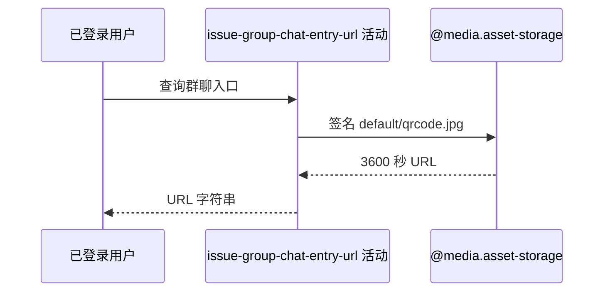

## 概要

为固定群聊二维码对象生成一小时七牛临时访问地址。

## 时序图

## 触发条件

`GET /system/qrcode` 通过 Bearer 鉴权后执行。

## 活动契约

无业务入参；返回固定对象的一小时签名 URL 字符串，不封装业务对象、不另返期限，也不持久化签发结果。

## 异常分支

| 错误标识 | 触发条件 | 处理 |
|---|---|---|
| `SYSTEM_ERROR` | 七牛域名、访问凭据或签名构址失败 | 不交付地址，无需业务补偿 |

## 领域依赖

### @media.asset-storage

- 输入：固定 key `default/qrcode.jpg` 与 3600 秒访问意图
- 输出：临时签名 URL 或失败

## 业务动作

A1 选择固定二维码 key
A2 构造并签名下载地址
A3 返回 URL 字符串

## 详细流程

1. 登录身份只用于入口鉴权，不影响素材选择。
2. `A1` 始终使用 `default/qrcode.jpg`，不读取 `system.group.qrcode` 配置，也不探测对象存在性。
3. `A2` 根据域名是否以 https 开头决定协议，去掉已有协议前缀并拼 key；用 access/secret 签名到当前 Unix 秒+3600，bucket 不参与。
4. `A3` 直接返回单个 URL 字符串，不记录签发结果或改变状态。

## 边界情况

- 对象不存在时仍可能成功签发一个无法打开的地址。
- 域名或凭据格式问题在签名阶段失败。
- 每次调用重新签发，同一固定资源可得到不同截止时间。

## 实现提示

活动无数据库读取，`reads` 为空；七牛签名通过 `@media.asset-storage` 表达，RPC snapshot 当前缺失。
