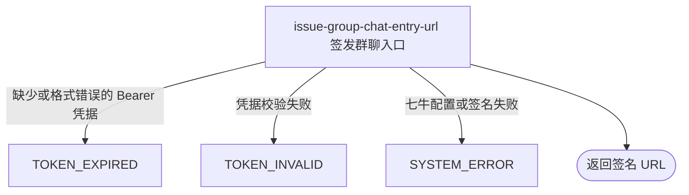

## 概要

向已登录用户签发固定群聊二维码素材的一小时临时访问地址。

## 触发

已登录用户需要获取平台群聊入口二维码时发起。每次查询都为同一存储对象重新生成一个时效一小时的访问地址。

## 接口契约

请求参数：无。请求头必须包含有效的 `Authorization: Bearer <token>`。

成功响应的 `data` 直接是带七牛签名和截止时间的 URL 字符串，不是 `{qrcode: ...}` 对象、base64 内容，也不另行返回有效期字段。

## 业务活动

- issue-group-chat-entry-url  为固定群聊二维码对象签发一小时临时访问地址

## 流程图

## 详细流程

1. 识别当前登录用户；该路径未标记可选鉴权，缺少或无效 Bearer 令牌的请求在签名前被拒绝。用户身份不影响素材选择。
2. 始终选择写死的七牛对象 key `default/qrcode.jpg`；不读取已登记的 `system.group.qrcode` 配置，也不查询或验证该对象是否存在。
3. 取七牛访问域名，根据域名是否以 `https` 开头决定协议，移除域名的 `http://` 或 `https://` 前缀，并与固定 key 组装下载地址。
4. 使用当前七牛 access key 和 secret key 生成签名，截止时间为当前 Unix 秒加 3600。签名过程不使用 bucket 配置。
5. 以单个字符串作为成功数据返回签名 URL；不返回单独的有效期字段，不记录签发结果，也不改变任何业务状态。

## 异常分支

| 对外失败码 | 触发条件 | 由哪个活动报出 | 补偿动作或超时处理 | 对外提示 |
|---|---|---|---|---|
| `TOKEN_EXPIRED` | `Authorization` 缺失、空白或不以 `Bearer ` 开头 | 流程入口鉴权 | 不签发地址，无需补偿 | 登录已过期，请重新登录 |
| `TOKEN_INVALID` | Bearer 令牌校验失败 | 流程入口鉴权 | 不签发地址，无需补偿 | 令牌无效 |
| `SYSTEM_ERROR` | 七牛域名或访问凭据缺失、格式不可用，或七牛库构建签名 URL 失败 | issue-group-chat-entry-url | 不交付本次地址；流程不持久化签发结果，无需补偿 | 系统异常，请稍后重试 |

本流程不校验 `default/qrcode.jpg` 是否真实存在。即使对象不存在，签名仍可能成功并返回后续无法打开的 URL，本接口不将其视为查询失败。

## 技术线索

- HTTP：`GET /system/qrcode`，需普通 Bearer 鉴权
- 固定对象：`default/qrcode.jpg`
- 未使用配置：`system.group.qrcode`
- 签名：`QiniuConfiguration.buildSignedUrl()`，截止时间为当前 Unix 秒 `+3600`
- 七牛属性：`qiniu.domain`、`qiniu.access-key`、`qiniu.secret-key`；`qiniu.bucket` 不参与本次签名 URL 构造
