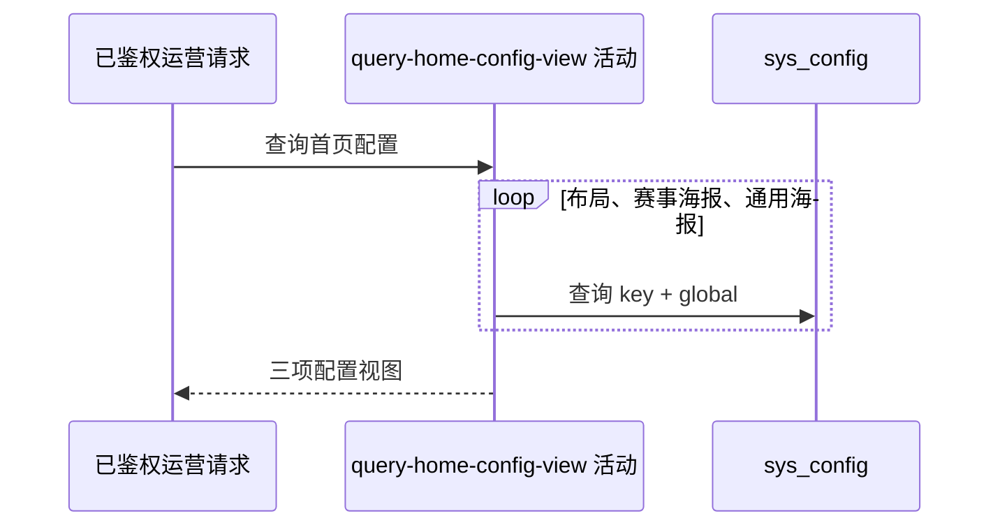

## 概要

按固定顺序组装三项可编辑首页配置的当前视图。

## 时序图

## 触发条件

`GET /system/admin/home/config` 通过运营密钥鉴权后执行。

## 活动契约

无业务入参；固定返回布局、赛事海报、通用海报三项配置的当前值、默认值、版本和覆盖状态。活动只读。

## 异常分支

| 错误标识 | 触发条件 | 处理 |
|---|---|---|
| `SYSTEM_ERROR` | 任一配置查询或组装失败 | 不返回部分列表 |

## 领域依赖

无

## 业务动作

A1 按固定三项顺序查询
A2 选择库值或默认值
A3 组装版本和覆盖状态

## 详细流程

1. 依次查询 `home.layout.config`、`home.tournament.poster.config`、`home.poster.config` 的 global 记录。
2. enabled 记录原样使用库值且 overridden=true；不存在或停用使用枚举默认值且 false。
3. 无记录 version=0，有记录返回库内版本，即使停用；说明和默认值来自枚举。
4. 不解析或校验当前 JSON，不回退已启用非法内容，也不修改配置。

## 边界情况

- 列表始终三项且顺序固定。
- 已启用但用户首页无法解析的 JSON 仍原样返回。
- 停用记录回退默认值但保留库内版本。

## 实现提示

只读列按 DB snapshot 精确声明；运营鉴权在流程入口完成。
