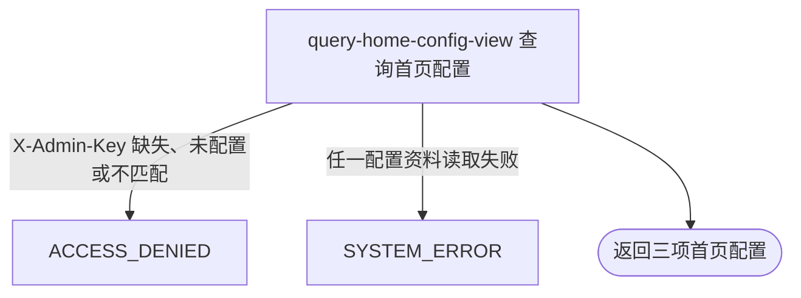

## 概要

向运营后台交付首页布局、赛事海报区和通用海报三项可编辑配置。

## 触发

运营后台需要查看三项可编辑首页配置的当前内容和版本时发起。

## 接口契约

请求参数：无。请求头必须包含 `X-Admin-Key`。

成功返回 `configs` 列表，固定为 3 项，依次是 `home.layout.config`、`home.tournament.poster.config`、`home.poster.config`。每项包含 `key`、`description`、`configValue`、`defaultValue`、`version` 和 `overridden`。

## 业务活动

- query-home-config-view  组装并交付三项可编辑首页配置视图

## 流程图

## 详细流程

1. 请求先经过运营后台鉴权；只有服务端已配置且请求携带一致的 `X-Admin-Key` 才继续，不要求普通用户登录。
2. 以固定顺序查询 `home.layout.config`、`home.tournament.poster.config` 和 `home.poster.config` 在 `scope=global` 下的记录；不遍历其他已登记配置。
3. 对每项，已启用记录使用库内 `configValue` 并标记 `overridden=true`；记录不存在或已停用时使用枚举默认值并标记 `overridden=false`。
4. 记录不存在时 `version=0`；只要记录存在就返回库内版本，包括已停用记录。配置说明和默认值始终来自当前枚举名录。
5. 不解析或校验当前值中的 JSON，已启用的非标准内容仍原样返回。一次性交付三项 `configs` 列表，不修改配置或生成用户首页内容。

## 异常分支

| 对外失败码 | 触发条件 | 由哪个活动报出 | 补偿动作或超时处理 | 对外提示 |
|---|---|---|---|---|
| `ACCESS_DENIED` | 服务端未配置运营密钥，或 `X-Admin-Key` 缺失、空白或不匹配 | 流程入口鉴权 | 未开始查询，无需补偿 | 无权限访问 |
| `SYSTEM_ERROR` | 任一配置的数据库查询或结果组装失败 | query-home-config-view | 终止整体查询，不返回部分列表；本流程只读，无需补偿 | 系统异常，请稍后重试 |

配置记录不存在或已停用都正常回退默认值。已启用但 JSON 内容无法被用户首页解析时，本查询仍将其原样返回，不报错、回退或修复。

## 技术线索

- HTTP：`GET /system/admin/home/config`
- 鉴权：`AdminApiKeyInterceptor`，`X-Admin-Key` / `admin.api-key`
- 固定配置：`HOME_LAYOUT_CONFIG`、`HOME_TOURNAMENT_POSTER_CONFIG`、`HOME_POSTER_CONFIG`
- 持久化：`sys_config`，`scope=global`
- 组装：`HomeConfigAdminAppService.get()` / `buildItem()`
- 响应：`HomeConfigDTO.configs` / `HomeConfigItemDTO`
