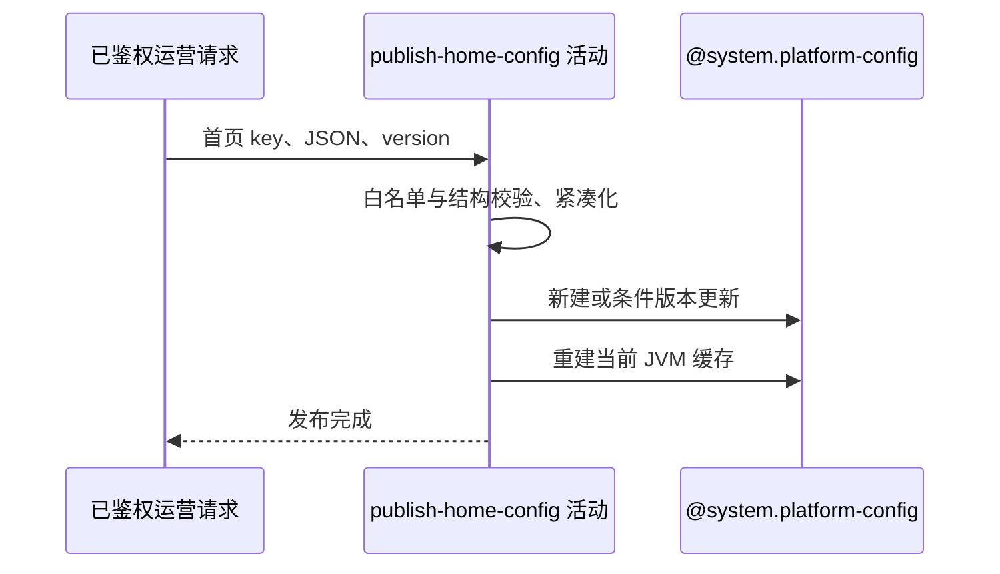

## 概要

校验一项首页布局或海报 JSON，以乐观版本发布并刷新当前进程缓存。

## 时序图

## 触发条件

`POST /system/admin/home/config/update` 已通过运营鉴权和必填校验后执行。

## 活动契约

入参 key 仅限三项首页配置、对应 JSON 字符串和版本；首次版本 0，更新版本必须命中。成功重新启用配置并刷新当前 JVM 缓存。

## 异常分支

| 错误标识 | 触发条件 | 处理 |
|---|---|---|
| `PARAM_ERROR` | key 不在首页白名单、超长或 JSON 规则失败 | 不写配置 |
| `OPERATION_FAILED` | 首次版本非 0、条件更新未命中或保存失败 | 回滚数据库 |
| `SYSTEM_ERROR` | 数据库约束、缓存刷新或提交失败 | 数据库回滚；缓存不补偿 |

## 领域依赖

### @system.platform-config

- 输入：首页配置键、紧凑 JSON、版本、说明与重新启用意图
- 输出：首次版本 1 或匹配版本加一，并刷新当前实例缓存

## 业务动作

A1 校验首页白名单和 JSON
A2 首次插入或乐观版本更新
A3 重建当前 JVM 缓存

## 详细流程

1. `A1` 只允许布局、赛事海报、通用海报三 key；长度上限 100000 字符。
2. 布局为最多 30 个区域的数组；id 必填唯一、64 位内且字符受限；type 限六种，除 POSTER 外同类唯一。POSTER 还需标题和海报数组。
3. 赛事海报对象需标题、副标题和海报数组；通用海报本身为数组。每数组最多 20 项，海报 type 仅 NAVIGATE/PREVIEW 且 image 必填；通过后紧凑序列化。
4. `A2` 无记录仅接受 version=0，建 global/json/enabled/version1；已有记录用 id+version 条件更新值和说明、重新启用并加一，不重写 valueType。
5. `A3` 同一事务内重建当前 JVM 全部 enabled 配置缓存，不通知其他实例；后续失败数据库回滚但缓存不补偿。

## 边界情况

- 空区域数组和空海报数组允许。
- 不校验额外字段、图片或跳转目标真实可用。
- 应用允许 100000 字符但表列仅 2048，长 JSON 可在数据库阶段失败。

## 实现提示

写入通过 `@system.platform-config` 表达，`reads` 为空；首页白名单是相对全局更新入口的额外限制。
