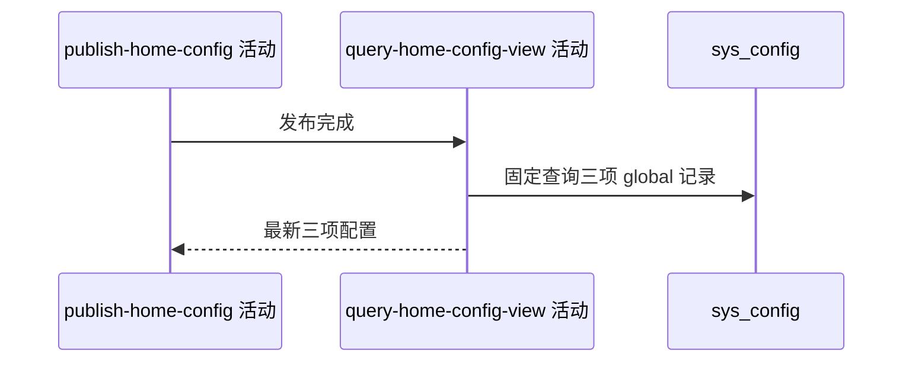

## 概要

发布后重读并交付三项首页配置的最新视图。

## 时序图

## 触发条件

首页配置发布及当前实例缓存刷新成功后、事务提交前执行。

## 活动契约

返回固定三项配置的当前值、默认值、版本与覆盖状态。活动只读，失败回滚数据库发布但不补偿缓存。

## 异常分支

| 错误标识 | 触发条件 | 处理 |
|---|---|---|
| `SYSTEM_ERROR` | 任一配置读取或组装失败 | 不返回部分结果，数据库回滚，缓存不补偿 |

## 领域依赖

无

## 业务动作

A1 固定查询三项配置
A2 选择生效值与元数据

## 详细流程

1. 依次查询布局、赛事海报、通用海报的 global 记录。
2. enabled 记录用库值且 overridden=true；缺失或停用用默认值且 false。
3. 无记录 version=0，有记录返回库内版本；本次项应体现版本加一。
4. 不解析 JSON，完整组装后返回；失败使数据库事务回滚。

## 边界情况

- 返回顺序和数量固定。
- 若本活动失败，缓存可能仍保留未提交新值。
- 停用记录在独立查询中回退默认值。

## 实现提示

只读列按 DB snapshot 声明；与独立首页配置查询共享相同投影口径。
