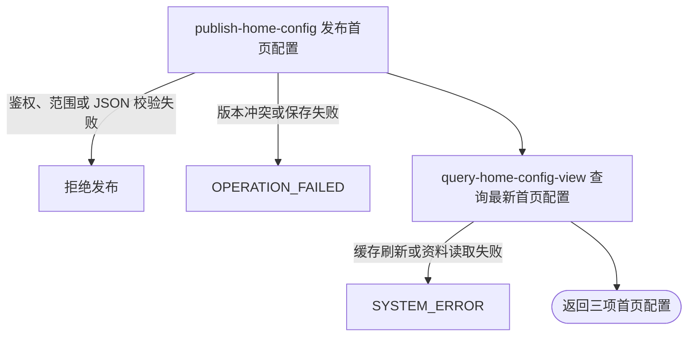

## 概要

校验并发布一项首页布局或海报配置，然后交付三项首页配置的最新视图。

## 触发

运营后台需要首次发布、重新启用或更新首页布局、赛事海报区或通用海报时发起。

## 接口契约

请求头：`X-Admin-Key` 必填且必须与服务端 `admin.api-key` 匹配。

请求体包含 `key`、`configValue` 和 `version`。`key` 必须是 `home.layout.config`、`home.tournament.poster.config`、`home.poster.config` 之一；`configValue` 必须是非 `null` 的对应 JSON 字符串；`version` 必须非 `null`，首次发布为 0，更新时与库内版本一致。

成功返回 `configs` 列表，固定按上述顺序包含三项首页配置的 `key`、`description`、`configValue`、`defaultValue`、`version` 和 `overridden`。

## 业务活动

- publish-home-config  校验并以乐观版本发布一项已启用首页配置
- query-home-config-view  组装并交付三项首页配置的最新视图

## 流程图

## 详细流程

1. 通过 `X-Admin-Key` 完成运营后台鉴权，不要求普通用户登录。接收非空白 `key`、非 `null` 的 `configValue` 和 `version`。
2. 仅允许 `home.layout.config`、`home.tournament.poster.config` 和 `home.poster.config`；其他即使是已登记配置也拒绝。内容长度不得超过 100,000 个 Java 字符。
3. 布局配置必须是 JSON 数组且最多 30 个区域。每个区域必须是对象，`id` 非空、唯一、最长 64 位且仅含字母、数字、下划线或中划线；`type` 限于六种类型，除 `POSTER` 外同类只能出现一次。
4. `POSTER` 区域还要求非空标题和海报数组。赛事海报配置必须是包含非空标题、副标题和海报数组的 JSON 对象；通用海报配置本身必须是海报数组。
5. 每个海报数组最多 20 项，每项必须是对象，`type` 仅允许 `NAVIGATE` 或 `PREVIEW`，`image` 必须非空白。空区域数组和空海报数组允许；其他字段及引用对象的实际可用性不校验。通过后将整体重新序列化为紧凑 JSON。
6. 首次发布仅接受 `version=0`，建立 `scope=global`、`valueType=json`、`enabled=true`、`version=1` 的记录。已有记录（包括已停用）必须提交与库内一致的版本，然后原子更新值和说明、重新启用并将版本加 1；已有记录的 `valueType` 不重写。
7. 在数据库事务提交前清空并重建当前 JVM 的全部启用配置缓存，不同步其他运行实例。
8. 重新查询并返回三项首页配置的当前值、默认值、版本和覆盖状态。后续失败会使数据库事务回滚，但进程内缓存不受事务回滚保护。

## 异常分支

| 对外失败码 | 触发条件 | 由哪个活动报出 | 补偿动作或超时处理 | 对外提示 |
|---|---|---|---|---|
| `ACCESS_DENIED` | 运营密钥未配置，或 `X-Admin-Key` 缺失、空白、不匹配 | 流程入口鉴权 | 未开始发布，无需补偿 | 无权限访问 |
| `PARAM_ERROR` | `key` 空白，或 `configValue` / `version` 为 `null` | 流程参数校验 | 不产生配置变更 | 配置 key／内容／版本不能为空 |
| `PARAM_ERROR` | `key` 不是三项首页配置之一 | publish-home-config | 不产生配置变更 | 该配置不允许在首页配置中心修改 |
| `PARAM_ERROR` | 内容超过 100,000 个 Java 字符，或不是对应结构的有效 JSON | publish-home-config | 不产生配置变更 | 配置内容不能超过 100KB／配置格式无效 |
| `PARAM_ERROR` | 区域或海报数量、对象格式、区域标识、类型、标题、副标题、海报图片不符合详细流程第 3-5 步 | publish-home-config | 不产生配置变更 | 指明具体区域或海报问题 |
| `OPERATION_FAILED` | 首次发布版本不是 0，或已有记录的提交版本未命中条件更新 | publish-home-config | 数据库事务回滚，不覆盖当前版本 | 配置已被其他人修改，请刷新后重试 |
| `OPERATION_FAILED` | 首次配置的保存操作返回失败 | publish-home-config | 数据库事务回滚 | 配置保存失败 |
| `SYSTEM_ERROR` | 数据库实际长度或约束拒绝，或缓存刷新、最新视图查询、事务提交发生未处理异常 | publish-home-config / query-home-config-view | 数据库事务回滚，不返回部分视图；进程内缓存无事务补偿，可能已被清空、部分重建或保留未提交值 | 系统异常，请稍后重试 |

空区域数组和空海报数组可正常发布。当前不校验 `enabled`、`cityAware` 类型，不要求普通动态区的其他字段，不校验海报标题、副标题和跳转目标，也不验证图片 key 或跳转目标真实可用。

应用校验上限是 100,000 个 Java 字符，但当前 `sys_config.config_value` 是 `VARCHAR(2048)`；通过应用校验的长内容仍可被数据库拒绝。

## 技术线索

- HTTP：`POST /system/admin/home/config/update`
- 鉴权：`AdminApiKeyInterceptor`，`X-Admin-Key` / `admin.api-key`
- 请求：`HomeConfigUpdateCmd`
- 允许范围：`HomeConfigAdminAppService.HOME_KEYS`
- 校验与归一：`validateAndNormalize()` / `validateHomeSections()` / `validatePosters()`
- 发布：`HomeConfigAdminAppService.update()` / `save()`，`@Transactional`
- 并发更新：`SysConfigService.updateValueIfVersion()`
- 缓存：`SystemConfig.init()`，仅刷新当前 JVM
- 响应：`HomeConfigAdminAppService.get()`，固定三项
