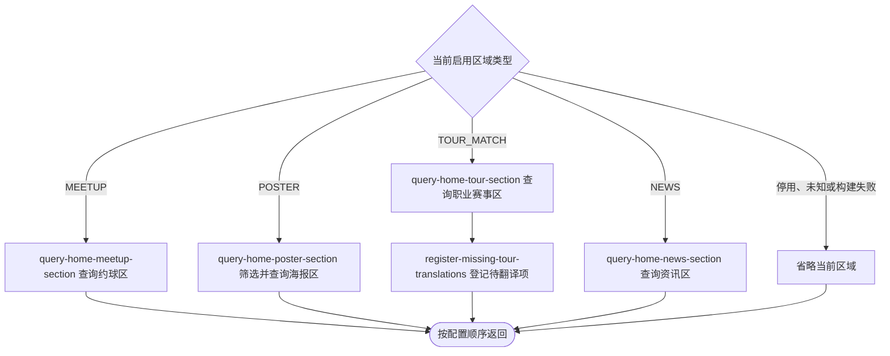

## 概要

按当前首页配置、查询城市和可选登录身份，组装并交付有序的首页区域列表。

## 触发

用户或匿名访问者进入首页时发起。调用方可指定城市，登录身份仅影响“我的约球”内容。

## 接口契约

请求参数：可选查询参数 `cityCode`，未传或仅含空白时使用 `330100`。可选请求头 `Authorization: Bearer <token>`；缺失或无效时不报鉴权错误，改按匿名访问。

成功返回 `displayItems` 数组，只包含成功形成的区域，并保持首页布局配置顺序。每项包含 `displayType` 和与类型对应的 `data`：

- `MEETUP`：标题、副标题和最多 10 张约球卡片；匿名时卡片数组为空。
- `POSTER_CARD`：标题、副标题和海报数组；海报包含 `type`、`imageUrl`、标题、副标题及已完成占位符替换的微信/应用/网页导航值。
- `TOUR_MATCH`：标题、副标题和赛事组数组；每组交付代表赛事、巡回赛、级别、首个比赛日、首个球场、签名图片和比赛。
- `NEWS_TIMELINE`：标题、副标题和固定为空的 `newsItems`。

接口不接受分页、区域类型或内容筛选参数，也不返回被省略区域的错误列表。

## 业务活动

- query-home-meetup-section  交付匿名空列表或本人最多十张进行中约球卡片
- query-home-poster-section  按城市可见性筛选并交付统一海报区域
- query-home-tour-section  交付当前职业赛事分组及最近比赛
- register-missing-tour-translations  为首页职业赛事展示中未命中的简体中文文本登记待翻译项
- query-home-news-section  交付资讯区域文案与当前空资讯列表

## 流程图

## 详细流程

1. 接收可选 `cityCode` 和可选 Bearer 令牌。令牌缺失或无效都按匿名访问继续；城市编码为 `null` 或裁剪后为空时使用 `330100`，非空值则不裁剪、不校验开通或名录存在性。
2. 从当前运行实例的 `home.page.config` 读取完整 JSON 根对象及其 `sections` 数组。当前值缺失时由系统配置机制提供完整默认 JSON；解析失败、根结构错误或 `sections` 不是数组时，记录日志并整体回退完整默认 JSON。按数组顺序遍历，对象为空或 `enabled=false` 时跳过；`enabled` 缺失或非明确 `false` 均视为启用。
3. 区域 `type` 为空或不是 `MEETUP`、`TOUR_MATCH`、`POSTER`、`NEWS` 时省略。旧的 `TOURNAMENT_POSTER` 和 `COURT_POSTER` 不再识别。每个区域的构建异常都单独捕获并记录，省略该区域后继续处理后续配置。
4. `MEETUP` 区域使用配置标题，空白时回退“我的约球”，副标题原样取值。匿名访问返回空约球列表；已识别用户查询其报名状态为 `JOINED`、`REVIEWED` 或 `SKIPPED`，约球状态为 `OPEN`且结束时间未到的记录，按业务编号倒序取前 10 条并组装卡片，不返回续页标识。
5. `POSTER` 区域直接使用区域内的标题、副标题和海报数组，忽略旧 `cityAware` 字段。先按数组顺序检查单张海报的 `cityId`：缺失、为 `null` 或空白时保留，非空时仅在与本次有效 `cityCode` 精确相等时保留。不匹配的海报不做后续交互解析、图片签名或导航处理。
6. 对可见海报按原顺序转换：`actionType` 必须可转为响应的 `NAVIGATE` 或 `PREVIEW` 交互类型；图片 key 为空白时 URL 为 `null`，否则签发一小时七牛 URL；文案原样取值。三个非空导航目标只允许 `{{cityId}}`、`{{cityName}}` 两种占位符；未登记、空白、未闭合或无配对的占位符使当前海报转换失败，终止该数组的后续处理并保留失败前已形成的海报。城市筛选后没有可见海报时，仍交付区域标题、副标题和空海报数组。
7. 将三个导航目标中每次出现的 `{{cityId}}` 全部替换为本次有效 `cityCode` 原字符串，不查询城市名录；只有任一导航目标实际包含 `{{cityName}}` 时才查询城市名称，并把全部 `{{cityName}}` 按原字符串替换，不额外编码。城市名无法取得时不交付当前海报并继续后续海报。没有占位符的导航目标保持原样，不再自动追加城市或 `mode` 参数。
8. `TOUR_MATCH` 区域查询开始日不晚于明天且结束日不早于昨天的赛事，过滤数字级别小于 250 的记录，保留空白或非数字级别。将日期重叠且城市名忽略大小写相同的赛事跨巡回赛合并，组内和组间按 `GS`、`1000`、`500`、`250`、其他级别及日期/编号排序，每组首项作为代表赛事。
9. 对每个赛事组查询未结束比赛，并补入这些比赛日期内已结束的比赛；双方球员都未确定的记录被过滤，单方确定则保留。按日期和球场分组后，首页只取最早日期组的排序首个球场及其全部比赛；缺少赛事编号、日期、球场或可展示比赛的组被省略。
10. 对已形成的赛事名、球场名和球员名查询简体中文缓存；有非空译文时替换，未命中时保留原文并尝试新建待翻译记录，单条保存失败只记录日志。已形成赛事记录数用于拼接“<数量>场ATP／WTA、进行中”副标题，不是比赛场次。
11. `NEWS` 区域使用配置标题和副标题，空白时分别回退“资讯”和“最新动态”，`newsItems` 始终为空列表。
12. 仅将成功构建的区域按原配置顺序加入 `displayItems`。没有可交付区域时返回空列表；本查询不修改首页配置或各内容源，但可因翻译缓存未命中而新增待翻译记录。

## 异常分支

| 对外失败码 | 触发条件 | 由哪个活动报出 | 补偿动作或超时处理 | 对外提示 |
|---|---|---|---|---|
| —（匿名降级） | Bearer 令牌缺失、格式错误或校验失败 | 流程入口可选鉴权 | 清除本次用户身份，“我的约球”使用空列表，其他区域继续 | 无 |
| —（默认配置） | `home.page.config` 解析失败、根结构错误或 `sections` 不是数组 | 流程编排 | 记录日志并整体使用完整默认首页 JSON 继续 | 无 |
| —（区域省略） | 区域已停用、为空、类型缺失或不支持 | 流程编排 | 不加入当前区域，继续处理后续配置 | 无 |
| —（区域省略） | 约球、城市名录、职业赛事/比赛/球员/种子、翻译缓存或七牛签名在某区域构建中抛出异常 | 对应区域查询 | 记录区域 id 和 type，省略整个当前区域；已形成和后续区域不受影响 | 无 |
| —（城市筛选） | 海报非空 `cityId` 与本次 `cityCode` 不匹配 | query-home-poster-section | 跳过该海报，不做后续解析或签名；继续同区域其他海报 | 无 |
| —（部分海报） | 可见海报对象为空、`actionType` 无效、图片签名失败，或导航目标包含未登记、空白、未闭合或无配对的占位符 | query-home-poster-section | 终止当前海报数组的后续处理，保留已形成海报 | 无 |
| —（单张海报省略） | 海报导航目标包含 `{{cityName}}`，但本次城市无法在名录中识别 | query-home-poster-section | 不交付当前海报，继续处理其他海报 | 无 |
| —（赛事组省略） | 某组没有有效赛事编号、未结束比赛日期、球场或可展示对阵 | query-home-tour-section | 该组返回空并继续其他组；全部组为空时省略职业赛事区 | 无 |
| —（原文回退） | 赛事名、球场名或球员名没有非空简体中文缓存，或待翻译记录保存失败 | register-missing-tour-translations | 保留原文；逐项尝试新增待翻译记录，失败仅记日志，可出现部分登记 | 无 |
| `SYSTEM_ERROR` | 完整默认首页 JSON 也无法解析或遍历，区域对象提取在区域保护块之外失败，或发生其他顶层未处理异常 | 流程编排 | 终止整个首页请求，不返回已形成区域。本流程无整体事务；在失败前已新建的待翻译记录不会回滚 | 系统异常，请稍后重试 |

没有当前职业赛事或可展示赛事组时省略 `TOUR_MATCH` 区域。比赛只确定一方球员时仍交付，另一方为 `null`；双方都未确定时过滤。职业赛事组的某次构建若抛出异常（而非按已知缺失条件返回空），由于组内没有独立捕获，会省略整个 `TOUR_MATCH` 区域。

## 技术线索

- HTTP：`GET /home/page?cityCode=...`，`@OptionalAuth`
- 顶层组装：`HomeAppService.getHomePage()` / `querySection()`
- 完整首页配置：`home.page.config`，根对象的 `sections` 按数组顺序交付
- 默认城市：`330100`；城市名：`CityConfig.getCityName()`
- 海报导航占位符：`{{cityId}}` 取最终 `cityCode`，`{{cityName}}` 取城市名；旧 `cityAware` 不再读取
- 我的约球：`UserMeetupAppService.queryUserMeetupList(IN_PROGRESS)`，默认 `size=10`
- 赛事分组：`TourTournamentQueryDomainService.findValidCurrentTournamentGroups(LocalDate.now())`
- 比赛分组：`TourMatchQueryDomainService.upcomingDateGroups()`，首页只取第一日期/第一球场
- 翻译：`TranslationQueryService.query()` / `TourTranslationService.matches()`，未命中可写入 `translation`
- 图片：`QiniuConfiguration.buildSignedUrl()`，时效 3600 秒
- 响应：`HomePageDTO.displayItems` / `HomeDisplayItemDTO` 及各 `BaseDisplayData` 子类
