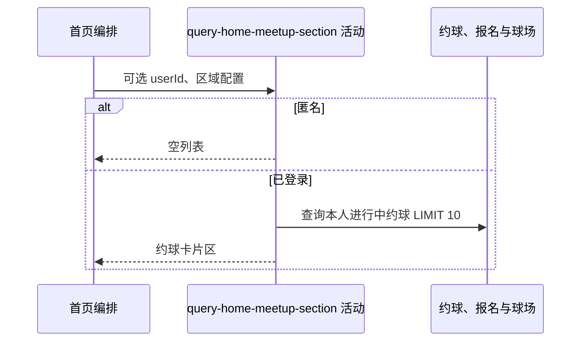

## 概要

匿名时交付空列表，登录时组装本人最多十张进行中约球卡片。

## 时序图

## 触发条件

首页布局遇到已启用 `MEETUP` 区域时执行。

## 活动契约

入参为区域 JSON 与可选当前用户；返回标题、副标题及最多十张卡片。匿名成功返回空卡片，不要求登录。

## 异常分支

| 错误标识 | 触发条件 | 处理 |
|---|---|---|
| 区域省略 | 约球、报名、球场或卡片转换异常 | 记录日志并省略本区域，其他区域继续 |

## 领域依赖

无

## 业务动作

A1 解析区域文案
A2 按身份选择空列表或进行中查询
A3 组装卡片

## 详细流程

1. 标题空白回退“我的约球”，副标题原样使用。
2. 匿名时直接返回空数组，不查询约球。
3. 已登录时查询本人报名 `JOINED/REVIEWED/SKIPPED`、约球 `OPEN` 且 end_time 未到的记录，按 biz_id 倒序取默认 10 条。
4. 将约球与可选球场背景组装成卡片，不交付分页游标或 hasMore。

## 边界情况

- 无进行中约球时区域仍返回，卡片为空。
- 可选鉴权失败会清除身份并走匿名分支。
- 任一构建异常省略整个区域而非首页失败。

## 实现提示

精确读列按 DB snapshot 声明；首页上限由默认分页大小 10 形成。
