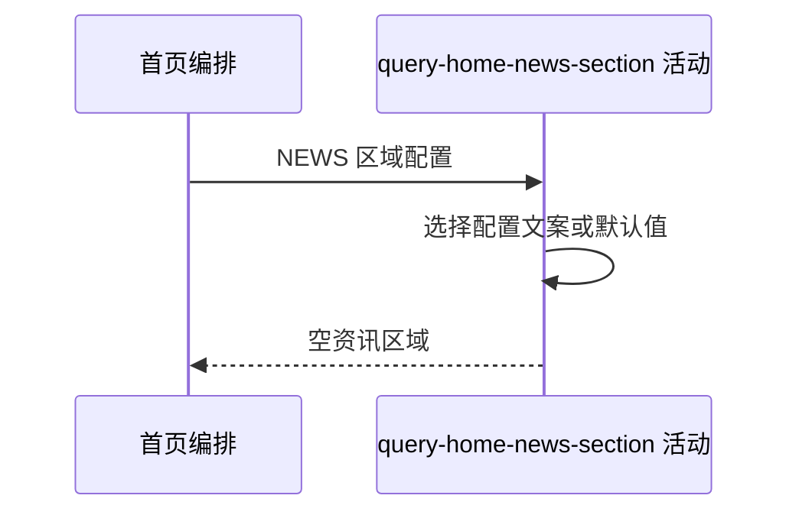

## 概要

组装资讯区域文案，并交付当前固定为空的资讯列表。

## 时序图

## 触发条件

布局遇到已启用 `NEWS` 区域时执行。

## 活动契约

入参为区域配置；返回标题、副标题和空 `newsItems`。活动无数据库读取与副作用。

## 异常分支

| 错误标识 | 触发条件 | 处理 |
|---|---|---|
| 区域省略 | 区域对象或文案提取出现未处理异常 | 记录日志并省略本区域 |

## 领域依赖

无

## 业务动作

A1 选择资讯文案
A2 建立空资讯列表

## 详细流程

1. 标题空白回退“资讯”，副标题空白回退“最新动态”。
2. 创建 `NEWS_TIMELINE` 区域，`newsItems` 固定为空数组。
3. 不查询新闻源、不分页、不写任何数据。

## 边界情况

- 区域仍可返回，即使当前没有任何资讯实现。
- 配置的非空文案原样返回。
- 本活动 `reads` 为空。

## 实现提示

这是纯内存投影；未来接入新闻数据源时需重新声明读模型和异常口径。
