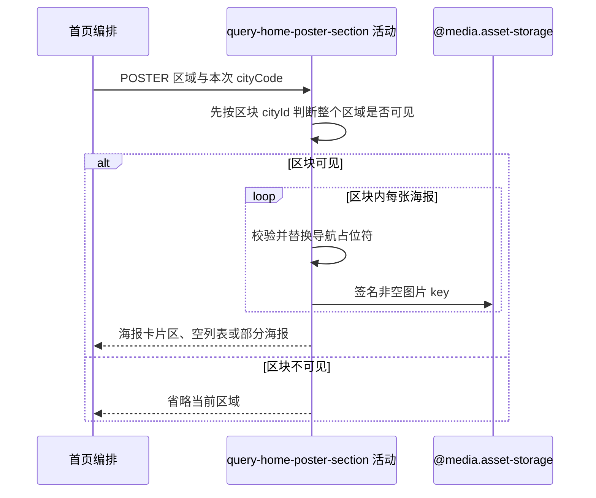

## 概要

按区块城市可见性筛选、替换导航占位符并组装统一海报卡片。

## 时序图

## 触发条件

完整首页配置遇到已启用的 `POSTER` 区域时执行；区域对象和最终有效 `cityCode` 已由首页编排传入。

## 活动契约

入参：

| 字段 | 类型 | 必填 | 约束 |
|---|---|---|---|
| section | 海报区域 | 是 | 类型为 `POSTER`，包含标题、可选副标题、可选区块 `cityId` 和海报数组；旧 `cityAware` 与单张海报的旧 `cityId` 被忽略 |
| cityCode | 字符串 | 是 | 首页编排已选定的本次有效城市编码 |

成功返回：

| 字段 | 类型 | 说明 |
|---|---|---|
| displayType | 枚举 | 固定为 `POSTER_CARD` |
| title | 字符串 | 区域标题 |
| subtitle | 字符串或空 | 区域副标题 |
| posters | 海报数组 | 区块可见时按原顺序转换的海报；可为空或部分成功 |

区块城市不匹配时返回空结果，由首页编排省略整个区域。

## 异常分支

| 错误标识 | 触发条件 | 来源 |
|---|---|---|
| `POSTER_SECTION_CITY_FILTERED` | 海报区块的非空 `cityId` 与本次 `cityCode` 不匹配 | query-home-content —（区块城市筛选） |
| `POSTER_PARTIAL` | 海报对象为空、`actionType` 无效、图片签名失败，或 URL 包含未登记、空白、未闭合或无配对的占位符 | query-home-content —（部分海报） |
| `POSTER_CITY_UNAVAILABLE` | 当前海报任一 URL 使用 `{{cityName}}`，但 `cityCode` 无法取得城市名 | query-home-content —（单张海报省略） |
| `POSTER_SECTION_FAILED` | 区域外层构建发生其他未处理异常 | query-home-content —（区域省略） |

## 领域依赖

### @media.asset-storage

- 输入：非空海报图片 key 与一小时访问意图
- 输出：签名 URL 或失败

## 业务动作

A1 按区块 cityId 判断本次城市是否可见
A2 校验并替换区块内海报的导航占位符
A3 转换可形成海报并签名图片

## 详细流程

1. `A1` 检查 `POSTER` 区块自身的 `cityId`。字段缺失、为 null 或 trim 后为空时视为全城市可见；其他值不裁剪、不规范化，仅与本次 `cityCode` 原字符串精确相等时区块可见。
2. 区块城市不匹配时直接返回空结果，由首页编排省略整个区域，不读取海报数组，也不执行 `A2` 或 `A3`。区块可见时按数组顺序处理全部海报；单张海报上的旧 `cityId` 作为未知字段忽略。
3. `A2` 检查三个导航 URL，只允许 `{{cityCode}}` 与 `{{cityName}}`；旧 `{{cityId}}` 和其他未登记、空白、未闭合或无配对的占位符使当前海报转换失败，按 `POSTER_PARTIAL` 保留此前结果并停止本区域后续海报。标题、副标题和其他字段中的大括号不参与检查。
4. 将三个 URL 中全部 `{{cityCode}}` 替换为本次 `cityCode` 原字符串，不查询城市名录。任一 URL 含 `{{cityName}}` 时只查询一次城市名，并替换三个 URL 中的全部出现位置；不额外编码。城市名不可用时省略当前海报并继续后续海报，不执行图片签名。
5. null 或空白 URL 原样保留，没有占位符的 URL 原样交付。旧 `cityAware` 完全忽略，不自动追加城市、`mode` 或其他参数；占位符规则对 `NAVIGATE` 与 `PREVIEW` 一致。
6. `A3` 将 `actionType` 转为响应的 `NAVIGATE` 或 `PREVIEW` 类型，投影文案和替换后的三端导航；非空图片 key 通过 `@media.asset-storage` 生成一小时 URL，空白 key 得到 null URL。对象、交互类型或图片签名转换失败时，保留此前已形成海报并停止本区域后续海报。
7. 将区域标题、副标题和已形成海报组装为 `POSTER_CARD`。区块可见但海报数组为空时仍返回区域与空数组。

## 边界情况

- 图片 key 空白时 URL 为 null。
- 区块 `cityId` 只有空白判定会裁剪；非空值包含前后空格时不会匹配通常的城市编码。
- 区块城市不匹配时整个区域省略，不会形成空海报区块；单张海报的旧 `cityId` 不参与筛选。
- 未知城市只影响 URL 实际使用 `{{cityName}}` 的当前海报，不影响只使用 `{{cityCode}}` 或没有占位符的海报。
- 旧 `{{cityId}}` 占位符不兼容，按未登记占位符处理；活动入参 `cityCode` 与区块可见性字段 `cityId` 不改名。
- 同一 URL 中同一占位符可重复出现，全部替换；已有查询参数不需要特殊拼接。
- 旧 `cityAware` 存在、缺失或取任何值都不改变结果。

## 实现提示

配置读列按 DB snapshot 声明；城市名来自内存名录，资源签名通过 `@media.asset-storage` 表达。
