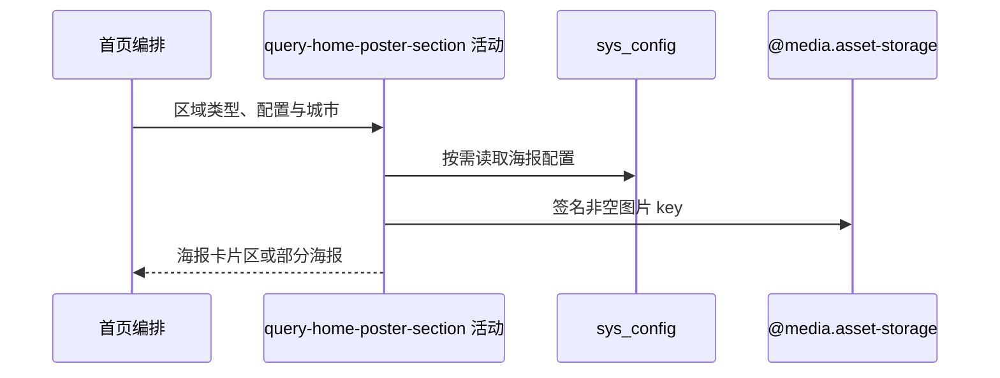

## 概要

按区域类型组装赛事、城市球场或自定义海报卡片，并签名图片地址。

## 时序图

## 触发条件

布局遇到 `TOURNAMENT_POSTER`、`COURT_POSTER` 或 `POSTER` 区域时执行。

## 活动契约

返回区域标题、副标题及按配置顺序形成的海报；单项失败终止该数组后续转换但保留此前项。活动不写配置。

## 异常分支

| 错误标识 | 触发条件 | 处理 |
|---|---|---|
| 部分海报 | 海报为空、类型非法、图片签名或城市导航失败 | 保留失败前项目，停止本数组后续 |
| 区域省略 | 球场区城市副标题或区域外层构建失败 | 省略整个区域，其他区域继续 |

## 领域依赖

### @media.asset-storage

- 输入：非空海报图片 key 与一小时访问意图
- 输出：签名 URL 或失败

## 业务动作

A1 选择区域文案与海报配置
A2 按需附加城市导航参数
A3 转换海报并签名图片

## 详细流程

1. 赛事海报读取对应对象配置，解析异常回退默认 JSON；区域非空文案优先，不附城市。
2. 球场海报标题默认“附近球场”，副标题默认使用城市名“寻找「城市」的球场”，读取通用海报配置并附城市。
3. 自定义 POSTER 直接用区域文案/数组，仅 `cityAware=true` 时附城市。
4. 非空导航值直接追加 `?cityCode=...&cityName=...&mode=view`，不识别已有查询参数也不 URL 编码。
5. 海报 type 转 NAVIGATE/PREVIEW，非空图片 key 生成一小时 URL，其他文案与三端导航原样投影；异常被数组级捕获并保留此前项。

## 边界情况

- 图片 key 空白时 URL 为 null。
- 未知城市可使球场区域省略；自定义城市感知区则保留已形成海报。
- 原 URL 已有 `?` 仍再追加 `?`。

## 实现提示

配置读列按 DB snapshot 声明；城市名来自内存名录，资源签名通过 `@media.asset-storage` 表达。
