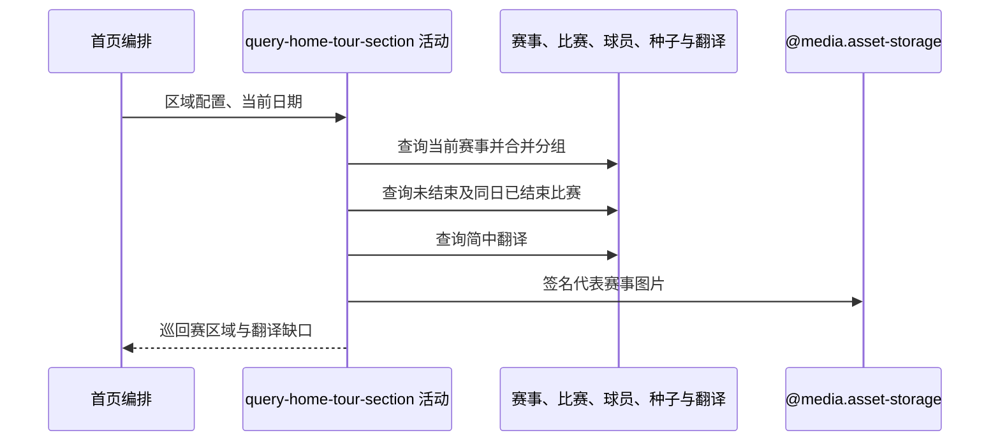

## 概要

查询当前职业赛事与最近比赛，分组排序、翻译并组装首页巡回赛区域。

## 时序图

## 触发条件

首页布局遇到已启用 `TOUR_MATCH` 区域时执行。

## 活动契约

返回成功形成的赛事组及最近比赛，并输出未命中简中翻译键供后续登记；没有可展示组时省略区域。

## 异常分支

| 错误标识 | 触发条件 | 处理 |
|---|---|---|
| 赛事组省略 | 组缺赛事编号、日期、球场或可展示比赛 | 跳过该组 |
| 区域省略 | 数据查询、分组、翻译或图片签名抛出异常 | 省略整个 TOUR_MATCH 区域，其他区域继续 |

## 领域依赖

### @media.asset-storage

- 输入：代表赛事图片 key 与一小时访问意图
- 输出：签名 URL 或失败

## 业务动作

A1 筛选合并当前赛事
A2 查询并分组最近比赛
A3 组装代表赛事与图片
A4 应用简中翻译并收集缺口

## 详细流程

1. `A1` 查询 start<=明天、end>=昨天的赛事；过滤可解析数字且小于250的 category，空白/非数字保留。日期重叠且城市忽略大小写相同则跨 tour 合并，并按 GS/1000/500/250/其他、日期、编号排序。
2. `A2` 每组查询未结束比赛并补入这些日期内已结束比赛；双方都未定过滤，单方确定保留。按日期/球场分组，只取最早日期的排序首个球场全部比赛。
3. 缺 tournamentIds、日期组、球场组或比赛时跳过该赛事组；代表取组内首项，tour 去重按 ATP/WTA/其他连接，图片签名一小时。
4. `A4` 对赛事名、球场名和球员名查询 zh_CN；非空译文替换，未命中保留原文并收集登记键。
5. 区域标题默认“巡回赛”；副标题按成功赛事记录中的 ATP/WTA 数量拼“进行中”，数量不是比赛场次。

## 边界情况

- 只确定一方球员的比赛仍返回，另一方 null。
- 首页只展示第一日期和第一球场，不展示同组其他日期/球场。
- 某组构建抛异常会因外层保护省略整个巡回赛区域。

## 实现提示

精确读列按 DB snapshot 声明；翻译查询与缺口登记分开，图片签名由 `@media.asset-storage` 表达。
