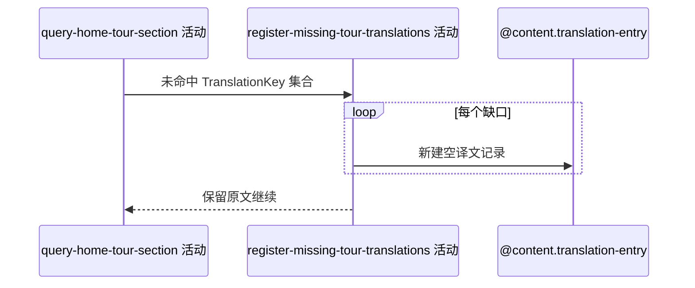

## 概要

为首页赛事、球场和球员的未命中简中原文登记待翻译记录。

## 时序图

## 触发条件

巡回赛区域形成展示数据且简中翻译查询存在未命中键时执行。

## 活动契约

入参为实体类型、原文、ZH_CN 的缺口集合；逐项尝试登记空译文记录。失败仅记录日志，展示继续使用原文。

## 异常分支

| 错误标识 | 触发条件 | 处理 |
|---|---|---|
| 原文回退 | 单条保存失败或唯一键竞争 | 记录日志，保留原文，继续其他缺口 |

## 领域依赖

### @content.translation-entry

- 输入：赛事/球场/球员类型、非空原文、ZH_CN 与待翻译状态
- 输出：新建待翻译记录，或已存在/失败结论

## 业务动作

A1 去重翻译缺口
A2 逐项登记待翻译记录
A3 容错并保留原文

## 详细流程

1. 对查询缓存与数据库均未得到非空译文的键形成缺口，原文展示已先保留。
2. `A1-A2` 按实体类型、原文、语言去重，尝试写 translated_text 为空的记录。
3. 每项保存独立容错；异常仅记日志并继续，不让翻译缺口使区域或首页失败。
4. 首页请求无整体事务，已成功登记项不会因后续顶层失败回滚。

## 边界情况

- 并发请求可竞争唯一键，失败请求仍返回原文。
- 空白或 null 原文不应形成有效登记键。
- 部分成功允许，活动不返回登记明细。

## 实现提示

写入通过已登记的 `@content.translation-entry` 聚合表达，`reads` 为空；本阶段不设计该领域。
