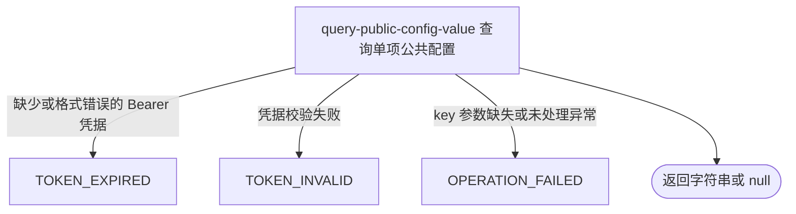

## 概要

向已登录用户交付一个任意配置标识当前可取得的字符串值。

## 触发

已登录用户需要按一个已知标识取得当前配置字符串时发起。

## 接口契约

请求头必须包含有效的 `Authorization: Bearer <token>`。查询参数 `key` 必须出现，但可以是空字符串；不做白名单、格式或长度校验。

成功响应的 `data` 是配置字符串；无已启用缓存值且未登记默认值时为 `null`。

## 业务活动

- query-public-config-value  按一个原始标识交付当前配置字符串或空值

## 流程图

## 详细流程

1. 要求普通 Bearer 登录鉴权；用户身份不参与配置权限或值的判定。
2. 接收必填查询参数 `key`，不裁剪、校验格式或限制可查名录；空字符串作为普通标识查询。
3. 先用输入字符串直接查找当前 JVM 的已启用配置缓存；因缓存键格式为 `<scope>|<configKey>`，调用方可直接传入带作用域的完整缓存键命中任意已启用记录。
4. 直接查找未命中时，再查找 `global|<key>`；命中时原样返回该已启用库值。
5. 缓存均未命中时，以原始 `key` 查找 `SystemConfigKey` 名录；已登记键返回枚举默认值，未登记键返回 `null`。
6. 以单个字符串或 `null` 作为成功数据交付；不返回配置说明、类型、版本、覆盖状态或来源，也不解析、校验或修改值。

## 异常分支

| 对外失败码 | 触发条件 | 由哪个活动报出 | 补偿动作或超时处理 | 对外提示 |
|---|---|---|---|---|
| `TOKEN_EXPIRED` | `Authorization` 缺失、空白或不以 `Bearer ` 开头 | 流程入口鉴权 | 未开始查询，无需补偿 | 登录已过期，请重新登录 |
| `TOKEN_INVALID` | Bearer 令牌校验失败 | 流程入口鉴权 | 未开始查询，无需补偿 | 登录凭证无效，请重新登录 |
| `OPERATION_FAILED` | 必填查询参数 `key` 未出现，或配置缓存查询出现未处理异常 | query-public-config-value | 终止查询；本流程只读，无需补偿 | 系统异常，请稍后重试 |

空字符串或不存在的标识不是错误，通常成功返回 `null`。已登记配置没有启用覆盖值时回退枚举默认值。

## 技术线索

- HTTP：`GET /system/config?key=...`，需普通 Bearer 鉴权
- 读取：`SystemConfig.getString(key)`
- 优先级：原始缓存键 → `global|<key>` → `SystemConfigKey` 默认值 → `null`
- 缓存来源：`SysConfigLoaderImpl.loadAll()`，仅已启用记录，键为 `<scope>|<configKey>`
- 结果：`Result<String>`
