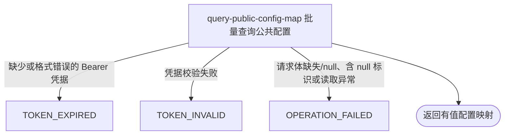

## 概要

向已登录用户交付一组任意配置标识中当前可取得的字符串值映射。

## 触发

已登录用户需要一次取得多个已知配置标识的当前字符串时发起。

## 接口契约

请求头必须包含有效的 `Authorization: Bearer <token>`。请求体是 JSON 字符串数组，没有数量上限和标识白名单；数组本身必须可遍历且不得包含 `null`，空数组允许。

成功响应的 `data` 是保留有值标识首次出现顺序的映射。无已启用缓存值且未登记默认值的标识不出现在映射中。

## 业务活动

- query-public-config-map  按一组原始标识交付所有可取得的当前配置字符串映射

## 流程图

## 详细流程

1. 要求普通 Bearer 登录鉴权；用户身份不参与配置权限或值的判定。
2. 接收 JSON 字符串数组请求体，没有数量上限，不裁剪、校验标识格式或限制可查名录。空数组正常返回空映射。
3. 按请求数组顺序逐项查询：先以输入字符串直接查找当前 JVM 的已启用配置缓存，再查找 `global|<key>`；两者未命中时，已登记键回退枚举默认值，未登记键得到 `null`。
4. 输入可直接使用 `<scope>|<configKey>` 命中任意作用域的已启用缓存记录。查询值为 `null` 的标识被省略；非 `null` 值以原输入标识作为映射键加入 `LinkedHashMap`。
5. 重复标识只保留一个映射项，后续写入覆盖值但不改变该键首次出现的顺序。空字符串若无可用值则被省略。
6. 请求体缺失或 JSON `null` 会使遍历失败；数组包含 `null` 时，配置缓存查找抛出异常。两者均终止整个请求，不返回已组装的部分映射。
7. 交付按首次出现顺序保留的“标识 → 字符串值”映射；不返回说明、类型、版本、覆盖状态或来源，也不解析、校验或修改值。

## 异常分支

| 对外失败码 | 触发条件 | 由哪个活动报出 | 补偿动作或超时处理 | 对外提示 |
|---|---|---|---|---|
| `TOKEN_EXPIRED` | `Authorization` 缺失、空白或不以 `Bearer ` 开头 | 流程入口鉴权 | 未开始查询，无需补偿 | 登录已过期，请重新登录 |
| `TOKEN_INVALID` | Bearer 令牌校验失败 | 流程入口鉴权 | 未开始查询，无需补偿 | 登录凭证无效，请重新登录 |
| `OPERATION_FAILED` | 请求体缺失或是 JSON `null`，数组包含 `null` 标识，或任一配置读取发生未处理异常 | query-public-config-map | 终止整个查询，不返回已组装的部分映射；本流程只读，无需补偿 | 系统异常，请稍后重试 |

空数组正常返回空映射。空字符串或未知标识查不到值时被省略；重复标识不产生重复映射项，并保留该键首次插入位置。

## 技术线索

- HTTP：`POST /system/config/batch`，需普通 Bearer 鉴权
- 请求：`@RequestBody List<String> keys`，无 `@Valid` 或数量限制
- 读取：对每项调用 `SystemConfig.getString(key)`
- 优先级：原始缓存键 → `global|<key>` → `SystemConfigKey` 默认值 → 省略
- 结果容器：`LinkedHashMap<String, String>`
