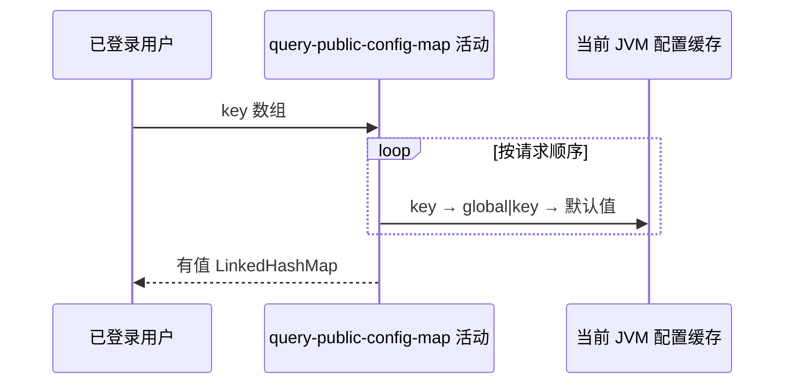

## 概要

按一组原始标识查询当前字符串值，保留有值键的首次出现顺序。

## 时序图

## 触发条件

`POST /system/config/batch` 通过 Bearer 鉴权并取得 JSON 字符串数组后执行。

## 活动契约

入参为可空数组但数组本身须可遍历且元素不可 null；返回所有非 null 值的原始 key 到字符串映射，保留首次插入顺序。活动只读。

## 异常分支

| 错误标识 | 触发条件 | 处理 |
|---|---|---|
| `OPERATION_FAILED` | 请求体缺失/JSON null、元素为 null 或任一缓存读取异常 | 终止全部查询，不返回部分映射 |

## 领域依赖

无

## 业务动作

A1 按请求顺序解析每个标识
A2 选择缓存值或默认值
A3 过滤 null 并写入有序映射

## 详细流程

1. 空数组返回空映射；无数量、格式、空白或白名单校验。
2. 每项依次查原始缓存键、`global|key`、枚举默认值；可用完整作用域键命中非 global enabled 值。
3. `A3` 值为 null 的 key 省略，非 null 以原输入 key 写入 LinkedHashMap。
4. 重复 key 后值覆盖但不改变首次插入位置。
5. 请求体或元素 null 会在遍历/缓存查找时失败，整体不返回部分结果。

## 边界情况

- 空字符串无值时被省略。
- 未知 key 不报错，只是不进入映射。
- 超大数组会逐项同步查询缓存，没有请求数量上限。

## 实现提示

缓存来源列按 DB snapshot 声明；请求过程本身不实时查询数据库，也不返回配置元数据。
