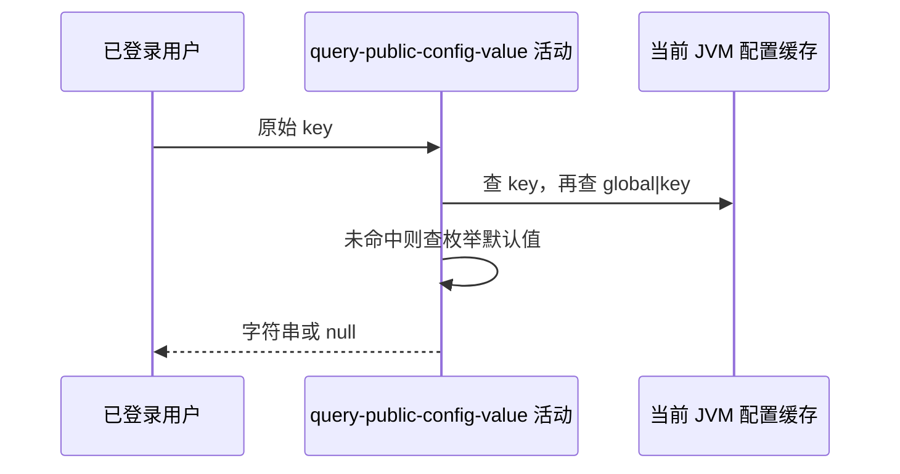

## 概要

按一个原始标识，从当前配置缓存或登记默认值取得字符串结果。

## 时序图

## 触发条件

`GET /system/config?key=...` 通过 Bearer 鉴权且 key 参数出现后执行。

## 活动契约

入参原始 key 可为空且不限白名单；返回单个字符串或 null，不返回说明、版本、来源和覆盖状态。活动只读。

## 异常分支

| 错误标识 | 触发条件 | 处理 |
|---|---|---|
| `OPERATION_FAILED` | key 参数缺失或配置缓存读取异常 | 终止查询 |

## 领域依赖

无

## 业务动作

A1 按原始缓存键查询
A2 按 global 缓存键查询
A3 回退登记默认值

## 详细流程

1. 不 trim、不校验格式或名录，空字符串作为普通 key。
2. `A1` 先直接查 key；调用方可传 `<scope>|<configKey>` 命中任意作用域 enabled 缓存值。
3. `A2` 未命中再查 `global|<key>`。
4. `A3` 仍未命中时，已登记 key 返回枚举默认值，未知 key 返回 null。
5. 值原样交付，不解析、校验或修改。

## 边界情况

- 接口名为 public config，但仍要求普通登录。
- 空串或未知 key 成功返回 null。
- 带作用域缓存键绕过 global 限定，但只能读当前缓存中 enabled 值。

## 实现提示

底层缓存由 `sys_config` enabled 记录加载，故声明其精确来源列；请求路径不实时查表。
