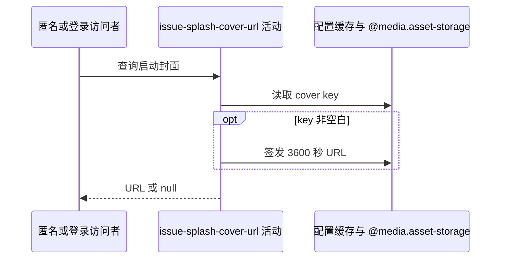

## 概要

读取当前启动封面 key，并为非空白对象签发一小时临时访问地址。

## 时序图

## 触发条件

调用 `GET /system/splash-cover` 时执行，可选鉴权失败按匿名继续。

## 活动契约

无业务入参；返回当前封面的一小时签名 URL 字符串，启用值空白时返回 null。不另返 key、来源或期限，不落库。

## 异常分支

| 错误标识 | 触发条件 | 处理 |
|---|---|---|
| `OPERATION_FAILED` | 七牛域名、凭据或签名构址失败 | 不交付地址，无业务补偿 |

## 领域依赖

### @media.asset-storage

- 输入：非空白启动封面 key 与 3600 秒访问意图
- 输出：签名 URL 或失败

## 业务动作

A1 读取生效封面 key
A2 处理空白结果或签名 URL
A3 交付字符串

## 详细流程

1. 登录身份不影响封面选择。
2. `A1` 读取 `system.splash.cover.key`：enabled global 缓存优先，缺失/停用回退默认 `default/splash-cover-20260821.jpg`。
3. `A2` 生效值为 null、空串或纯空白时直接返回 null，不再回退默认。
4. 非空白时根据 domain 决定协议并构址，用 access/secret 签名至当前 Unix 秒+3600，bucket 不参与。
5. 不探测对象存在性，不记录签发结果。

## 边界情况

- 配置指向不存在对象仍可能成功签出无法打开的 URL。
- 无覆盖和“启用空白覆盖”的结果不同：前者默认图，后者 null。
- 匿名与登录用户得到同一选择口径。

## 实现提示

缓存来源列按 DB snapshot 声明；资源签名通过 `@media.asset-storage` 表达，RPC snapshot 当前缺失。
