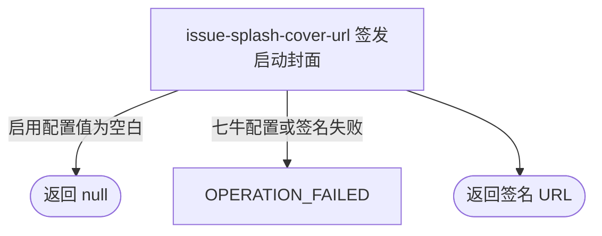

## 概要

向用户或匿名访问者签发当前启动封面图的一小时临时访问地址。

## 触发

用户或匿名访问者启动产品并需要当前公共封面图时发起。

## 接口契约

请求参数：无。可选请求头 `Authorization: Bearer <token>`；缺失或无效均不拒绝。

成功响应的 `data` 是当前封面对象的一小时七牛签名 URL 字符串；已启用配置值为空白时是 `null`。不另行返回对象 key、值来源或截止时间。

## 业务活动

- issue-splash-cover-url  为当前启动封面对象签发一小时临时访问地址

## 流程图

## 详细流程

1. 接受可选 Bearer 令牌；令牌缺失、格式错误或校验失败均按匿名访问继续，登录身份不影响封面选择。
2. 从当前 JVM 配置缓存读取 `system.splash.cover.key`；已启用全局覆盖值优先，未命中时使用枚举默认对象 `default/splash-cover-20260821.jpg`。
3. 对象 key 为 `null`、空字符串或仅含空白时，不回退默认封面，而是直接将成功数据设为 `null`。
4. 对非空白 key，根据七牛域名是否以 `https` 开头决定协议，移除域名的 HTTP(S) 前缀，与 key 构造下载地址，并使用 access key/secret key 签名；截止时间为当前 Unix 秒加 3600，bucket 配置不参与。
5. 直接交付签名 URL 字符串，不单独返回对象 key、值来源或有效期字段，不查询对象是否真实存在，也不持久化签发结果。

## 异常分支

| 对外失败码 | 触发条件 | 由哪个活动报出 | 补偿动作或超时处理 | 对外提示 |
|---|---|---|---|---|
| —（匿名降级） | Bearer 令牌缺失、格式错误或校验失败 | 流程入口可选鉴权 | 按匿名访问继续，封面选择不变 | 无 |
| —（默认封面） | 没有已启用的 `global` 覆盖值，包括保存记录不存在或已停用 | issue-splash-cover-url | 使用 `default/splash-cover-20260821.jpg` 继续签名 | 无 |
| —（空结果） | 已启用覆盖值为 `null`、空字符串或仅含空白 | issue-splash-cover-url | 不发起签名，不回退默认封面，成功返回 `null` | 无 |
| `OPERATION_FAILED` | 七牛域名或访问凭据缺失、格式不可用，或七牛库构建签名 URL 失败 | issue-splash-cover-url | 不交付本次地址；流程不持久化签发结果，无需补偿 | 系统异常，请稍后重试 |

本流程不查询对象存在性。配置指向不存在或无权读取的七牛对象时，仍可能成功返回后续无法打开的 URL。

## 技术线索

- HTTP：`GET /system/splash-cover`，`@OptionalAuth`
- 配置：`system.splash.cover.key`，默认 `default/splash-cover-20260821.jpg`
- 值读取：`SystemConfig.getString()`，当前 JVM 已启用缓存优先
- 签名：`QiniuConfiguration.buildSignedUrl()`，截止时间为当前 Unix 秒 `+3600`
- 七牛属性：`qiniu.domain`、`qiniu.access-key`、`qiniu.secret-key`；`qiniu.bucket` 不参与本次 URL 构造
- 响应：`Result<String>`
