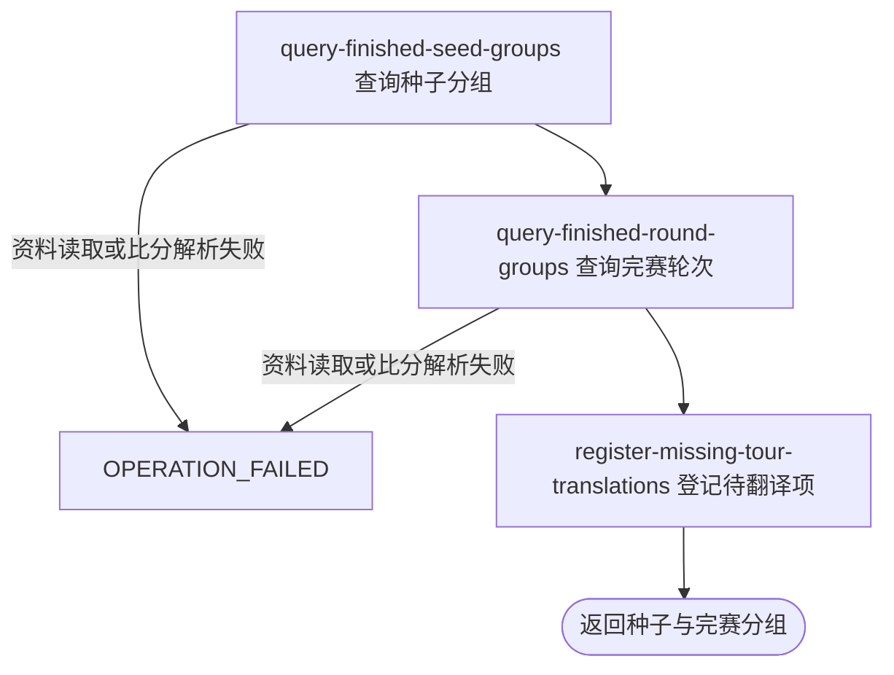

## 概要

按一组职业赛事标识，向用户或匿名访问者交付种子状态分组和分轮完赛结果。

## 触发

用户或匿名访问者需要同时查看一个或多个职业赛事的种子状态和完赛结果时发起。

## 接口契约

查询参数 `tournamentIds` 必须出现，可以逗号或重复查询参数形成字符串列表。不要求登录，不接收年份、签表类型、轮次或分页条件，也没有标识格式、存在性、数量上限或去重校验。

成功返回：

- `seed`：仅包含有数据的 `ATP`、`WTA`、`OUT` 种子分组；每项包含球员、国家/地区、种子号、状态、淘汰轮次标签、所属赛事和巡回赛。
- `match`：完赛轮次分组；每场比赛包含标识、赛事、轮次、日期/时间、球场、状态、对阵、种子、国家/地区、胜者、盘分、当前盘/末盘比分和时长。

两部分没有数据时分别返回空列表；不返回未命中赛事标识或各年份的单独占位。

## 业务活动

- query-finished-seed-groups  根据所查赛事的种子与完赛败者交付 ATP、WTA 和出局分组
- query-finished-round-groups  交付所查赛事按轮次组织的完赛对阵和比分
- register-missing-tour-translations  为未命中的简中球员姓名和球场名登记待翻译项

## 流程图

## 详细流程

1. 接收必填的 `tournamentIds` 查询参数列表。该路径不要求登录，不校验标识格式、存在性、数量、重复或年份；同一赛事标识的不同年份数据会合并。
2. 先以完整输入列表作为当前 JVM `finished` 缓存键查找一分钟内的已组装结果；列表顺序和重复项参与缓存键等值。命中时直接返回缓存 DTO，不重查数据或翻译。
3. 缓存未命中时，查询所有输入赛事的签表和种子参赛者，仅保留种子号非 `null` 且不为 0 的记录；按 `playerId` 批量补充球员姓名和国家/地区，并按 `tournamentId` 补充巡回赛类型。
4. 查询输入赛事的全部 `FINISHED` 比赛，对每个有胜者的比赛，将另一方球员按 `playerId` 记为已淘汰并保留该轮次；不验证胜者是否属于对阵双方，也不以赛事标识隔离同一球员的淘汰状态。
5. 种子球员出现在淘汰映射时设为 `ELIMINATED`，用已知轮次映射中文标签并归入 `OUT`；否则设为 `ACTIVE`，仅 `tour` 忽略大小写等于 `ATP` 时归入 `ATP`，其他值全部归入 `WTA`。只交付实际有数据的分组，组顺序为 `ATP`、`WTA`、`OUT`，组内按种子号升序，同号无稳定次序。
6. 独立再查一次输入赛事的 `FINISHED` 比赛，按实际开始时间倒序，缺失时间的排最后；时间相同时没有额外稳定排序。双方 `playerId` 都为空的比赛被过滤，仅有一方时仍保留。
7. 按所有保留比赛的球员标识和所查赛事的种子资料批量补齐对阵。球员资料缺失时使用外部 `playerId` 同时作为姓名，国家/地区为空；已有球员姓名优先姓、否则名。国家/地区码无法识别时，原码作为代码和名称，旗帜代码为空。
8. `sets_json` 为 `null` 或空白时映射为空盘分列表；非空白时必须能解析为盘分数组，否则中断整个查询。每场比赛同时交付轮次原值/中文标签、日期、计划/实际时间、球场、状态、胜者、盘分、当前盘数/末盘比分和小时分钟时长。
9. 按轮次原值分组，已知轮次按 `F`、`SF`、`QF`、`R16`、`R32`、`R64`、`R96`、`R128` 排序，未知轮次保留原值、中文名为空并排在已知轮次之后；多个未知轮次之间保持按完赛时间排序后的首次出现顺序。
10. 对种子姓名、比赛球员姓名和比赛球场查询简体中文缓存；非空译文命中时替换，未命中时保留原文并逐条尝试新增待翻译记录，保存失败仅记日志。
11. 将种子分组和完赛轮次分组组装为同一响应，任一部分无数据时使用空列表。成功结果缓存一分钟；待翻译记录的写入不与整个查询共享事务，后续失败不回滚已成功登记的项。

## 异常分支

| 对外失败码 | 触发条件 | 由哪个活动报出 | 补偿动作或超时处理 | 对外提示 |
|---|---|---|---|---|
| `OPERATION_FAILED` | 必填查询参数 `tournamentIds` 未出现 | 流程入口参数绑定 | 未开始查询，不产生缓存或业务数据变更 | 系统异常，请稍后重试 |
| `OPERATION_FAILED` | 签表、参赛者、赛事、比赛、球员或种子数据任一次读取/映射失败，或非空白 `sets_json` 无法解析为盘分数组 | query-finished-seed-groups / query-finished-round-groups | 终止整个请求，不返回已组装的种子或比赛部分，不写入成功结果缓存 | 系统异常，请稍后重试 |
| `OPERATION_FAILED` | 翻译缓存查询或回写发生未捕获异常 | register-missing-tour-translations | 终止整个请求，不写入成功 DTO 缓存；此前已保存的待翻译记录不回滚 | 系统异常，请稍后重试 |

单条待翻译记录保存失败会被捕获并只记录日志，不导致查询失败。未知赛事、部分赛事无数据、非 `FINISHED` 比赛、双方球员都为空、种子号为 0/空都仅被省略，不报错。

种子球员资料缺失时保留 `playerId` 和种子号，姓名/国家为空；比赛球员资料缺失时姓名回退为 `playerId`。胜者为空或不属于对阵双方、比分字段局部缺失、只有一方球员的 `FINISHED` 比赛仍可交付；异常胜者可使对阵双方都被记为淘汰。

## 技术线索

- HTTP：`GET /tour/match/finished?tournamentIds=...`，在普通鉴权排除列表中
- 应用编排：`TourMatchAppService.finished()`
- 缓存：`@Cacheable(value="finished", key="#p0")`，Caffeine `expireAfterWrite=1 minute`
- 种子：`TourMatchQueryDomainService.seedGroups()` / `seeds()`
- 完赛：`finishedRoundGroups()` / `finishedMatches()`，仅 `status=FINISHED`
- 比分解析：`TourConvertMapper.jsonToSets()`
- 轮次排序：`TourRoundEnum` 声明顺序
- 翻译：`TourMatchAppService.translate()` / `TranslationQueryService.query()`，未命中可写入 `translation`
- 响应：`TourMatchDTO.seed` / `TourMatchDTO.match`
