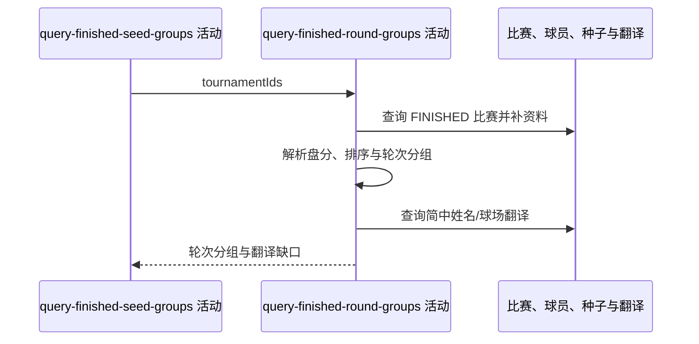

## 概要

查询所查赛事全部完赛对阵，补球员与种子，解析盘分并按轮次分组。

## 时序图

## 触发条件

种子分组查询成功后执行。

## 活动契约

入参赛事列表；返回按轮次组织的所有可展示 FINISHED 比赛，并输出未命中翻译键。无数据返回空列表。

## 异常分支

| 错误标识 | 触发条件 | 处理 |
|---|---|---|
| `OPERATION_FAILED` | 数据读取、非空盘分 JSON 解析或翻译查询失败 | 终止整个请求，不缓存成功 DTO |

## 领域依赖

无

## 业务动作

A1 查询并排序完赛比赛
A2 补球员、种子、国家和比分
A3 按轮次分组
A4 应用简中翻译并收集缺口

## 详细流程

1. `A1` 独立查询 FINISHED 比赛，started_at 倒序、null 最后；双方 playerId 都空过滤，单方保留。
2. `A2` 球员资料缺失时姓名回退 playerId；补种子、国家、胜者、状态、日期时间、球场和时长。sets_json null/空白为空列表，非空必须解析成功。
3. currentSet 为盘数，末盘双方分数形成 currentSetScore；局部比分缺失保留 null。
4. `A3` 按轮次原值分组，已知顺序 F/SF/QF/R16/R32/R64/R96/R128，未知排后并保持首次出现顺序。
5. `A4` 对种子/比赛球员姓名和球场查 zh_CN，非空译文替换，未命中保留原文并输出缺口。

## 边界情况

- 未知国家码原码作代码和名称，旗帜为空。
- winner 为空或不属于对阵仍交付。
- 时间相同无稳定次级排序。

## 实现提示

只读列按 DB snapshot 声明；成功响应由上层缓存一分钟。
