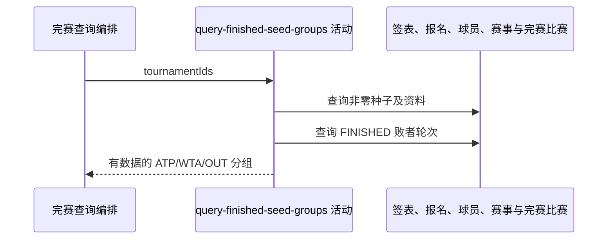

## 概要

按所查赛事种子与完赛败者，组装 ATP、WTA 和已出局种子分组。

## 时序图

## 触发条件

匿名或登录访问者调用完赛查询且一分钟 finished 缓存未命中时执行。

## 活动契约

入参为原始赛事标识列表；返回仅有数据的 ATP、WTA、OUT 种子组。列表不去重、不校验年份或存在性，活动只读。

## 异常分支

| 错误标识 | 触发条件 | 处理 |
|---|---|---|
| `OPERATION_FAILED` | 签表、报名、赛事、比赛、球员读取或映射失败 | 终止整个完赛查询 |

## 领域依赖

无

## 业务动作

A1 查询有效种子资料
A2 建立完赛败者轮次映射
A3 分类并排序种子

## 详细流程

1. `A1` 查询输入赛事的签表与参赛者，仅保留 seed 非 null 且非 0；补球员姓名/国家和赛事 tour。
2. `A2` 查询全部 FINISHED 比赛；有 winner 时把另一侧按 playerId 记为淘汰轮次，不校验 winner 属于双方，也不按赛事隔离同一球员。
3. `A3` 命中败者映射即 ELIMINATED/OUT；其余 ACTIVE，tour 忽略大小写等于 ATP 归 ATP，所有其他值归 WTA。
4. 仅返回非空分组，顺序 ATP、WTA、OUT；组内 seed 升序，同号无稳定次序。

## 边界情况

- 种子球员资料缺失时保留 playerId/seed，姓名国家为空。
- 异常 winner 可把双方都记为淘汰。
- 同一赛事不同年份因只用 tournamentId 会合并。

## 实现提示

精确读列按 DB snapshot 声明；原始输入列表的顺序与重复参与上层缓存键。
