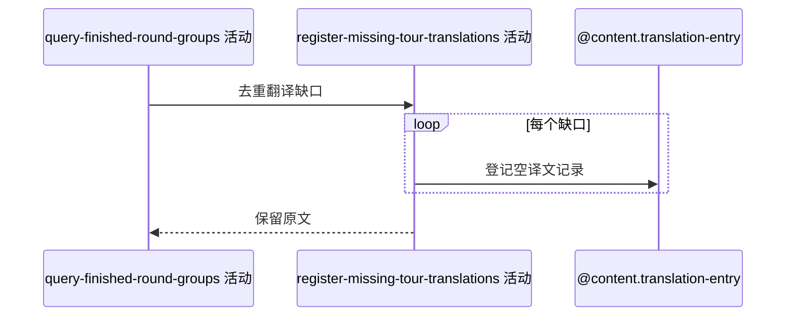

## 概要

为完赛展示中未命中的简中球员姓名与球场名登记待翻译项。

## 时序图

## 触发条件

种子和完赛分组的球员姓名或球场简中翻译未命中时执行。

## 活动契约

逐条登记 ENTITY/original/ZH_CN 待翻译记录；单条失败仅记日志并保留原文，未捕获的缓存/回写异常可终止请求。

## 异常分支

| 错误标识 | 触发条件 | 处理 |
|---|---|---|
| 单项容错 | 单条保存重复或失败 | 记录日志并继续 |
| `OPERATION_FAILED` | 翻译回写未捕获异常 | 终止查询，不缓存 DTO；已保存项不回滚 |

## 领域依赖

### @content.translation-entry

- 输入：球员/球场实体类型、原文与 ZH_CN
- 输出：待翻译记录或失败结论

## 业务动作

A1 去重未命中键
A2 逐项登记
A3 保留原文并完成响应

## 详细流程

1. 非空译文已应用；仅未命中键进入登记。
2. 按实体类型、原文、语言去重并尝试创建 translated_text 为空记录。
3. 单项异常只记录并继续；整体无事务，已成功项不因后续失败回滚。
4. 登记完成后组装 seed/match 响应并进入一分钟缓存。

## 边界情况

- 并发唯一键竞争不影响原文展示。
- 部分登记成功允许。
- 缓存命中时不重复查询或登记翻译。

## 实现提示

写入通过 `@content.translation-entry` 表达，`reads` 为空；本阶段不设计领域。
