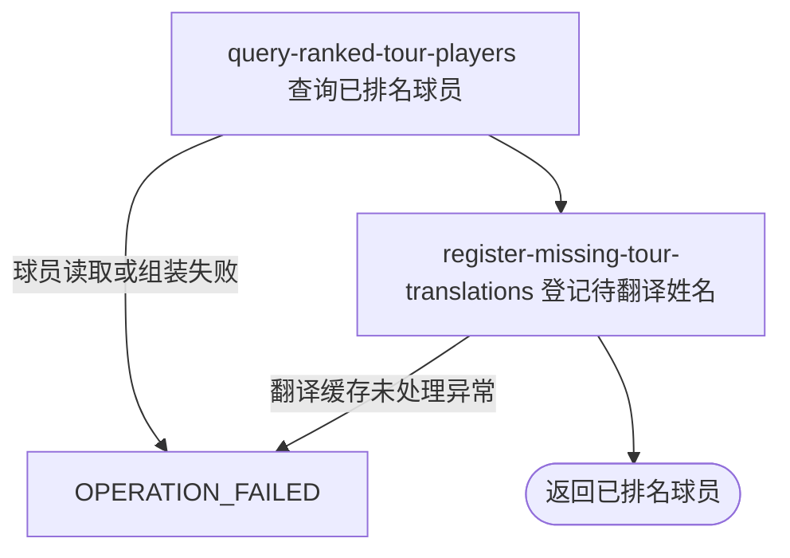

## 概要

按巡回赛标识向用户或匿名访问者交付当前已排名职业球员的积分与基础资料列表。

## 触发

用户或匿名访问者需要查看某一职业巡回赛当前已排名球员清单时发起。

## 接口契约

查询参数 `tour` 必须出现。不要求登录；空白值允许并直接返回空列表，非空白值不限于 `ATP` / `WTA`，不裁剪且只转为大写后精确查询。

成功返回完整已排名球员数组，每项包含 `id`、`rank`、`name`、`country`、`points`、`age` 和 `birthDate`。不分页，不返回 `tour`、头像、性别、持拍手或数据更新时间。

## 业务活动

- query-ranked-tour-players  按巡回赛交付排名升序的球员积分与基础资料
- register-missing-tour-translations  为简中缓存未命中的球员完整姓名登记待翻译项

## 流程图

## 详细流程

1. 接收必填查询参数 `tour`。该路径在普通登录鉴权排除列表中，匿名可用；参数缺失由全局异常处理拒绝。
2. `tour` 为空字符串或仅含空白时直接返回空列表，不查数据、不登记待翻译项。非空白值转为大写但不裁剪，不限制为 `ATP` 或 `WTA`。
3. 按大写后的 `tour` 精确查询球员，只保留 `rank` 非 `null` 的记录，按排名升序；排名相同时没有稳定次级排序，不分页且没有数量上限。
4. 为每名球员交付 `id`、`rank`、`points`、`name`、`country`、`age` 和 `birthDate`；不返回本次 `tour`、头像、性别或持拍手。
5. 姓名以非 `null` 的 `firstName` 和 `lastName` 按“名 + 空格 + 姓”拼接并裁剪整体边缘；两者都缺失时为空字符串。
6. 国家/地区码为 `null` 时 `country=null`；命中内置三位码时交付标准代码、中文名和两位旗帜码；未识别时原码同时作为代码和名称，旗帜码为 `null`。
7. 出生日期存在时，按当地当日与出生日期的 `Period.getYears()` 计算周岁，并以 `yyyy-MM-dd` 返回日期；未校验未来日期，因此可产生负年龄。日期缺失时 `age` 和 `birthDate` 都为 `null`。
8. 按组装后的完整姓名查询简体中文翻译缓存。命中非空译文时替换姓名；未命中或库内条目的 `translated_text` 为空时保留原文，并逐条尝试新增待翻译记录。已有空译文条目可因唯一约束发生重复冲突，单条保存失败只记录日志。
9. 一次性交付完整排名列表。本流程不修改球员或排名资料；待翻译登记不与整体查询共享事务，后续失败不回滚已保存条目。

## 异常分支

| 对外失败码 | 触发条件 | 由哪个活动报出 | 补偿动作或超时处理 | 对外提示 |
|---|---|---|---|---|
| `OPERATION_FAILED` | 必填查询参数 `tour` 未出现 | 流程入口参数绑定 | 未开始查询，不改变球员或翻译数据 | 系统异常，请稍后重试 |
| `OPERATION_FAILED` | 球员资料查询、DTO 组装或翻译缓存查询/回写发生未处理异常 | query-ranked-tour-players / register-missing-tour-translations | 终止整个请求，不返回已组装的部分球员；异常前已保存的待翻译项不回滚 | 系统异常，请稍后重试 |

`tour` 为空白、未知或没有已排名球员时成功返回空列表。出生日期或国家/地区码缺失、国家/地区码未识别、未来出生日期产生负年龄、球员标识或姓名为空都不会主动拒绝该球员。

单条待翻译保存因重复或其他原因失败时仅记录日志，保留原姓名并继续交付整体列表。

## 技术线索

- HTTP：`GET /tour/player/players?tour=...`，在普通鉴权排除列表中
- 应用服务：`TourPlayerQueryService.queryPlayers()`
- 查询：`TourPlayerRepository.listByTourOrderByRank()`，`tour = <大写输入>`、`rank IS NOT NULL`、`rank ASC`
- 年龄：`Period.between(birthDate, LocalDate.now()).getYears()`
- 国家/地区：`CountryEnum.getCountry()`
- 翻译：`TourTranslationService.players()` / `TranslationQueryService.query()`，语言 `ZH_CN`
- 响应：`List<PlayerQueryVO>`
