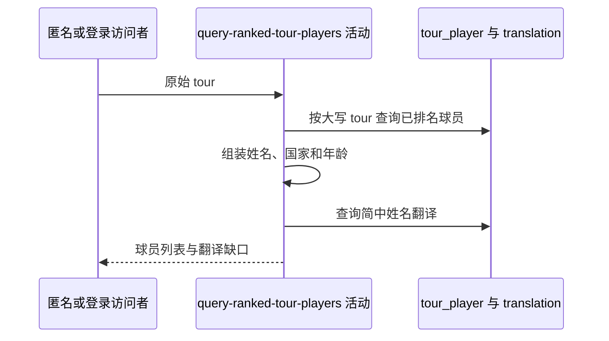

## 概要

按巡回赛标识查询排名升序球员，组装积分、姓名、国家与年龄资料。

## 时序图

## 触发条件

调用 `GET /tour/player/players?tour=...` 且参数出现时执行，匿名可用。

## 活动契约

入参原始 tour；空白返回空列表，非空白仅转大写后精确查询。返回全部已排名球员，不分页，并输出未命中姓名翻译键。

## 异常分支

| 错误标识 | 触发条件 | 处理 |
|---|---|---|
| `OPERATION_FAILED` | 球员读取、DTO 组装或翻译查询失败 | 终止整个请求，不返回部分列表 |

## 领域依赖

无

## 业务动作

A1 规范巡回赛查询值
A2 查询并排序已排名球员
A3 组装公开资料
A4 应用简中翻译并收集缺口

## 详细流程

1. tour 为空白直接返回空；非空只 `toUpperCase`，不 trim，不限制 ATP/WTA。
2. `A2` 精确查询 tour 且 rank 非 null，rank 升序，同名次无稳定次序，不限数量。
3. 姓名为 firstName+空格+lastName 后整体 trim；国家按内置三位码映射，未知码原样作代码/名称；出生日期按本地今日计算周岁和 yyyy-MM-dd。
4. 返回 id/rank/name/country/points/age/birthDate，不返回 tour、性别、持拍手或更新时间。
5. `A4` 按完整姓名查 ZH_CN；非空译文替换，未命中保留原名并输出登记键。

## 边界情况

- 未来出生日期会产生负年龄。
- 姓名两部分都缺失时为空字符串。
- 未知 tour 或无排名球员成功返回空列表。

## 实现提示

精确读列按 DB snapshot 声明；参数大写但不裁剪是当前真实口径。
