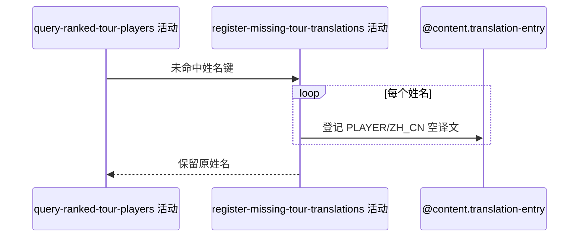

## 概要

为已排名球员中未命中的简中完整姓名登记待翻译项。

## 时序图

## 触发条件

排名球员完整姓名没有非空简中译文时执行。

## 活动契约

逐项登记 PLAYER、原始完整姓名、ZH_CN 待翻译记录；单条失败保留原名并继续。

## 异常分支

| 错误标识 | 触发条件 | 处理 |
|---|---|---|
| 单项容错 | 重复或单条保存失败 | 记录日志，保留原名，继续 |
| `OPERATION_FAILED` | 翻译查询/回写未捕获异常 | 终止请求；此前保存项不回滚 |

## 领域依赖

### @content.translation-entry

- 输入：PLAYER 类型、完整姓名、ZH_CN
- 输出：待翻译记录或失败结论

## 业务动作

A1 去重姓名缺口
A2 逐项登记待翻译记录
A3 保留原文返回

## 详细流程

1. 已有非空译文已替换；缺失或空译文姓名进入缺口。
2. 按 PLAYER/原文/ZH_CN 去重并尝试新建空译文记录。
3. 已有空译文记录可能触发唯一键冲突，单条失败仅记日志。
4. 查询无整体事务，后续失败不回滚已成功登记项。

## 边界情况

- 空完整姓名也可能形成翻译查询键，保存是否成功取决于约束。
- 并发登记允许一方唯一键失败。
- 不返回翻译登记状态。

## 实现提示

写入使用既有 `@content.translation-entry` 聚合，`reads` 为空。
