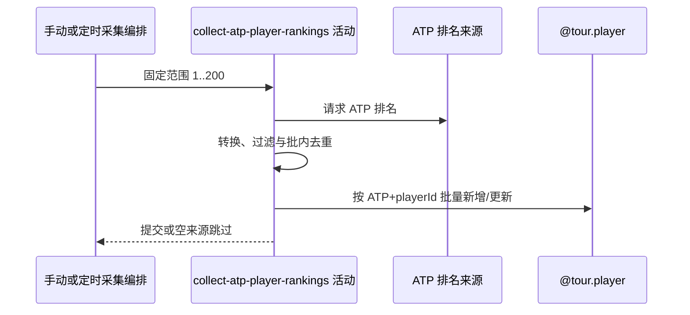

## 概要

请求 ATP 前 200 名排名，按巡回赛与球员身份新增或非空覆盖资料。

## 时序图

## 触发条件

手动入口直接执行；定时入口还需任务已装配且 active profiles 包含精确 `wechat`。

## 活动契约

固定采集 ATP 第 1～200 名；空来源正常跳过并继续 WTA，成功批次独立提交。无新增/更新统计返回。

## 异常分支

| 错误标识 | 触发条件 | 处理 |
|---|---|---|
| 空来源跳过 | 响应、排名节点或球员数组为空 | 不改 ATP，继续 WTA |
| `OPERATION_FAILED`/调度异常 | 来源、转换、查询或批量保存失败 | 回滚 ATP 当批并终止，不处理 WTA |

## 领域依赖

### @tour.player

- 输入：强制 tour=ATP 的外部球员身份与非空排名资料
- 输出：按 `(tour, playerId)` 新增或非空覆盖整批，失败回滚

## 业务动作

A1 请求 ATP 前 200 名
A2 转换、过滤与批内去重
A3 新增或非空覆盖球员

## 详细流程

1. `A1` 调用 ATP 来源固定 1..200；空响应/节点/数组不保存且继续后续巡回赛，抛异常则终止。
2. `A2` 转换 playerId、姓名、国家、rank、points、birthDate，强制 tour=ATP；出生日期空、过短或 ISO 解析失败为 null。
3. 丢弃 playerId/tour 为空记录，以 `(tour,playerId)` 批内去重并查询存量。
4. `A3` 未收录则新增；已有仅由来源非空字段覆盖。来源未出现的存量不删除、不清空排名。
5. 批量保存处于独立事务；提交后才进入 WTA。

## 边界情况

- 新球员缺数据库必填姓名可使整批失败。
- null 出生日期不覆盖存量旧值。
- 手动采集入口没有普通登录或运营鉴权。

## 实现提示

写入通过 `@tour.player` 表达，`reads` 为空；ATP 外部 RPC snapshot 当前缺失，来源契约按 Java 客户端确认。
