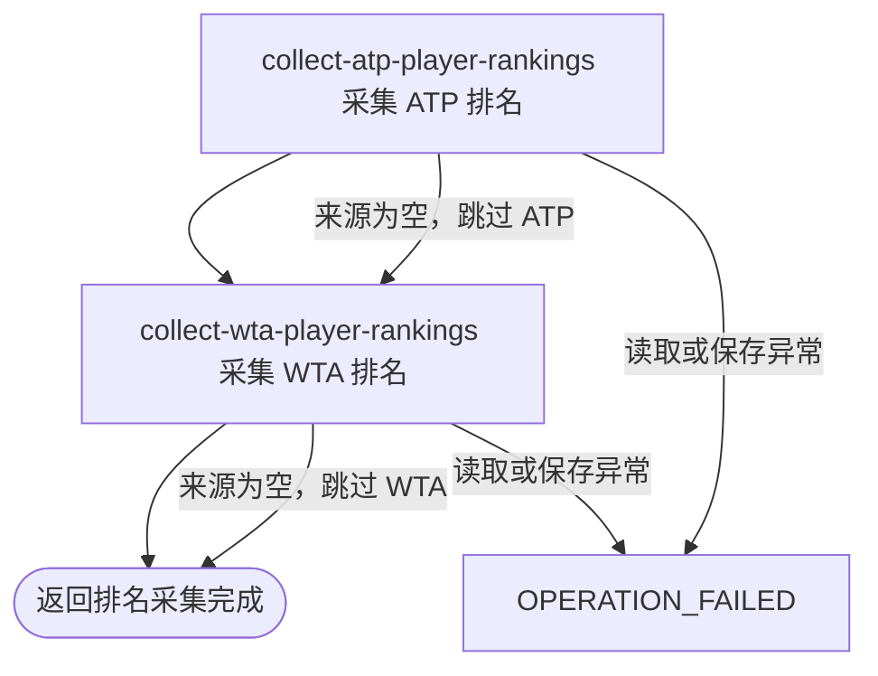

## 概要

手动依次采集并更新 ATP、WTA 前 200 名职业球员排名。

## 触发

运营或其他调用方需要立即刷新职业球员排名时发起。入口未纳入普通登录鉴权，不校验调用者身份；每次固定尝试 ATP、WTA 各前 200 名，不接收范围或巡回赛参数。

## 接口契约

### 请求参数

无。

### 成功响应

返回纯文本 `排名采集完成`。即使 ATP 或 WTA 来源返回空数据而被跳过，也仍可返回这一结果；不包含新增数、更新数、跳过数或分巡回赛结果。

## 业务活动

- collect-atp-player-rankings  采集并按球员身份新增或刷新 ATP 前 200 名排名资料
- collect-wta-player-rankings  采集并按球员身份新增或刷新 WTA 前 200 名排名资料

## 流程图

## 详细流程

1. 接收 `GET /tour/collect/rank` 请求。该路径位于普通登录鉴权排除范围内，不校验运营身份，也不接收采集范围参数。
2. 请求 ATP 第 1 至第 200 名排名。来源响应、排名节点或球员数组为空时跳过 ATP 保存并继续 WTA；来源调用抛出异常时立即终止，不再处理 WTA。
3. 将 ATP 来源球员整理为外部球员编号、姓名、国家或地区、排名、积分和出生日期，并强制标记巡回赛为 `ATP`。出生日期为空或解析失败时保留为 `null`。
4. 丢弃球员编号或巡回赛为空的记录，以 `(tour, playerId)` 在本批内去重并与存量球员匹配。新增未收录球员；已收录球员只用来源非空字段覆盖。来源未出现的存量球员不删除、不清空排名，也不标记为掉出前 200 名。
5. ATP 批次在一次独立事务中保存。该批保存异常时撤销 ATP 当批变更并终止流程；成功提交后才开始 WTA，因此后续 WTA 失败不会回滚 ATP。
6. 按与 ATP 相同的空来源、转换、去重、非空覆盖和独立事务规则处理 WTA 第 1 至第 200 名，并将巡回赛强制标记为 `WTA`。
7. 两个来源都处理结束后返回纯文本“排名采集完成”。一个或两个来源为空并被跳过时仍返回该结果；接口不交付新增、更新、跳过或分巡回赛统计。

## 异常分支

| 对外失败码 | 触发条件 | 由哪个活动报出 | 补偿动作或超时处理 | 对外提示 |
|---|---|---|---|---|
| 无 | ATP 来源响应、排名节点或球员数组为空 | collect-atp-player-rankings | 不改变 ATP 资料，继续处理 WTA；不补采、不返回跳过标记 | 排名采集完成 |
| 无 | WTA 来源响应、排名节点或球员数组为空 | collect-wta-player-rankings | 不改变 WTA 资料；已提交的 ATP 保留 | 排名采集完成 |
| `OPERATION_FAILED` | ATP 来源调用、转换、存量查询或批量保存发生未处理异常 | collect-atp-player-rankings | ATP 保存异常时回滚 ATP 当批；立即终止，不处理 WTA，不自动重试 | 系统异常，请稍后重试 |
| `OPERATION_FAILED` | WTA 来源调用、转换、存量查询或批量保存发生未处理异常 | collect-wta-player-rankings | WTA 保存异常时回滚 WTA 当批；已提交的 ATP 不回滚，不自动重试 | 系统异常，请稍后重试 |

来源记录缺少球员编号时只跳过该记录。出生日期为空、过短或无法按 ISO 日期解析时按 `null` 处理：存量球员保留旧出生日期，新球员可为空。其他来源字段为空时也不覆盖存量值；新球员若缺少数据库必填姓名，可能令该巡回赛整批保存失败。

## 技术线索

- HTTP：`GET /tour/collect/rank`；`WebMvcConfig` 将 `/tour/collect/**` 排除于普通 `AuthInterceptor`
- 入口：`TourCollectController.rank()` → `TourCollectFacade.rank()`
- 来源：`AtpClient.getRankings(1, 200)`、`WtaClient.getRankings(1, 200)`
- 采集：`PlayerCollectService.atpRank()` / `wtaRank()`，日期由 `parseDate()` 解析
- 保存：`TourPlayerService.saveOrUpdateBatch()`；事务按 ATP/WTA 两次调用分别生效
- 身份键：`tour + player_id`
