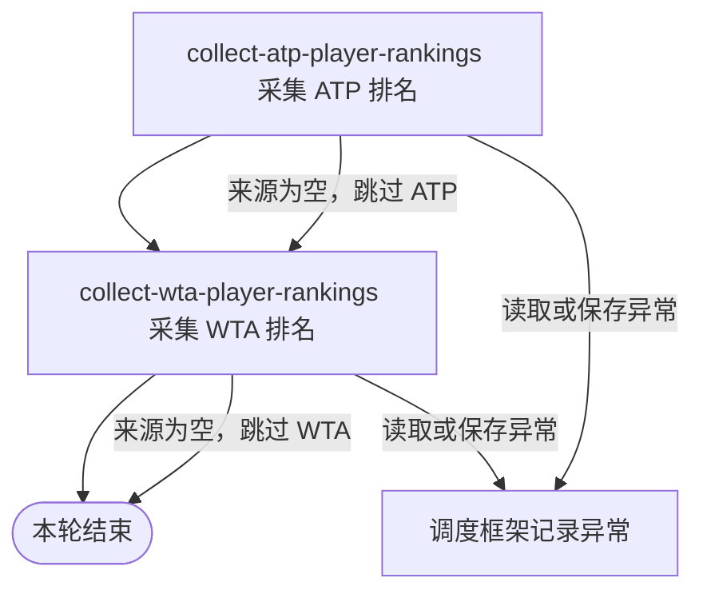

## 概要

每日采集并更新 ATP、WTA 前 200 名排名。

## 触发

职业赛事采集任务仅在 `job.tour.enabled=true` 时装配，并按 `job.tour.collect.rank.cron` 执行；生产配置为每日 `0 0 4 * * ?`。调度未指定时区，按应用运行时默认时区解释。每次触发还要求激活环境列表包含精确值 `wechat`，否则静默结束。

## 接口契约

### 请求参数

无。处理范围固定为 ATP、WTA 各第 1 至第 200 名。

### 成功响应

无对外响应。成功、非 `wechat` 环境跳过及来源为空跳过均不产生业务结果、数量统计或审计记录。

## 业务活动

- collect-atp-player-rankings  采集并按球员身份新增或刷新 ATP 前 200 名排名资料
- collect-wta-player-rankings  采集并按球员身份新增或刷新 WTA 前 200 名排名资料

## 流程图

## 详细流程

1. 仅在 `job.tour.enabled=true` 时装配职业赛事采集任务；任务按 `0 0 4 * * ?` 触发。调度声明未指定时区，实际按应用运行时默认时区解释。
2. 每次触发先检查激活环境列表是否包含精确值 `wechat`；不包含时直接结束，不请求来源、不改变数据，也不留下业务结果。
3. 请求 ATP 第 1 至第 200 名排名。来源响应、排名节点或球员数组为空时跳过 ATP 保存并继续 WTA；来源调用抛出异常时终止本次任务，不再处理 WTA。
4. 将 ATP 来源球员整理为外部球员编号、姓名、国家或地区、排名、积分和出生日期，并强制标记巡回赛为 `ATP`。出生日期为空或解析失败时保留为 `null`。
5. 丢弃球员编号或巡回赛为空的记录，以 `(tour, playerId)` 在本批内去重并与存量球员匹配。新增未收录球员；已收录球员只用来源非空字段覆盖。来源未出现的存量球员不删除、不清空排名，也不标记为掉出前 200 名。
6. ATP 批次在一次独立事务中保存。该批保存异常时撤销 ATP 当批变更并终止任务；成功提交后才开始 WTA，因此后续 WTA 失败不会回滚 ATP。
7. 按与 ATP 相同的空来源、转换、去重、非空覆盖和独立事务规则处理 WTA 第 1 至第 200 名，并将巡回赛强制标记为 `WTA`。
8. 两个来源都处理结束后静默结束，不产生新增、更新、跳过或分巡回赛统计；未处理异常由调度框架记录，不转换为业务提示或补偿任务。

## 异常分支

| 对外失败码 | 触发条件 | 由哪个活动报出 | 补偿动作或超时处理 | 对外提示 |
|---|---|---|---|---|
| 无 | 激活环境不包含精确值 `wechat` | 调度入口 | 不请求来源、不改变数据；后续仍按 cron 再次触发 | 无 |
| 无 | ATP 来源响应、排名节点或球员数组为空 | collect-atp-player-rankings | 不改变 ATP 资料，继续处理 WTA；不补采 | 无 |
| 无 | WTA 来源响应、排名节点或球员数组为空 | collect-wta-player-rankings | 不改变 WTA 资料；已提交的 ATP 保留 | 无 |
| 无 | ATP 来源调用、转换、存量查询或批量保存发生未处理异常 | collect-atp-player-rankings | ATP 保存异常时回滚 ATP 当批；终止本轮，不处理 WTA，不在本轮重试 | 无；调度框架记录异常 |
| 无 | WTA 来源调用、转换、存量查询或批量保存发生未处理异常 | collect-wta-player-rankings | WTA 保存异常时回滚 WTA 当批；已提交的 ATP 不回滚，不在本轮重试 | 无；调度框架记录异常 |

来源记录缺少球员编号时只跳过该记录。出生日期为空、过短或无法按 ISO 日期解析时按 `null` 处理：存量球员保留旧出生日期，新球员可为空。其他来源字段为空时也不覆盖存量值；新球员若缺少数据库必填姓名，可能令该巡回赛整批保存失败。

## 技术线索

- 任务：`TourCollectJob.rank()`；装配条件 `job.tour.enabled=true`
- 调度配置：`job.tour.collect.rank.cron`；生产值 `0 0 4 * * ?`，`@Scheduled` 未指定 `zone`
- 环境门槛：`environment.getActiveProfiles()` 包含 `wechat`
- 调用：`TourCollectFacade.rank()` → `PlayerCollectService.atpRank()` → `PlayerCollectService.wtaRank()`
- 来源：`AtpClient.getRankings(1, 200)`、`WtaClient.getRankings(1, 200)`
- 保存：`TourPlayerService.saveOrUpdateBatch()`；事务按 ATP/WTA 两次调用分别生效
- 身份键：`tour + player_id`
