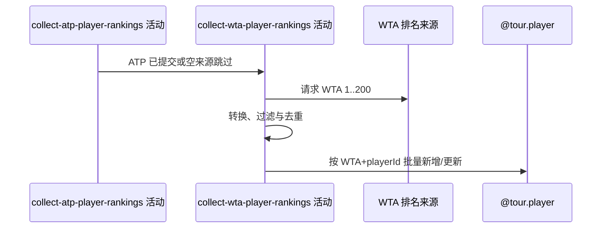

## 概要

ATP 活动结束后请求 WTA 前 200 名，按身份新增或非空覆盖球员资料。

## 时序图

## 触发条件

ATP 活动成功提交或因空来源跳过后执行；ATP 未处理异常时不执行。

## 活动契约

固定采集 WTA 第 1～200 名；空来源正常跳过。WTA 批次独立事务，失败不回滚已提交 ATP。

## 异常分支

| 错误标识 | 触发条件 | 处理 |
|---|---|---|
| 空来源跳过 | 响应、排名节点或球员数组为空 | 不改 WTA，整体仍可成功 |
| `OPERATION_FAILED`/调度异常 | 来源、转换、查询或保存失败 | 回滚 WTA 当批；ATP 保留 |

## 领域依赖

### @tour.player

- 输入：强制 tour=WTA 的球员身份与非空排名资料
- 输出：按 `(tour, playerId)` 新增或覆盖整批，失败回滚

## 业务动作

A1 请求 WTA 前 200 名
A2 转换、过滤与批内去重
A3 新增或非空覆盖球员

## 详细流程

1. 固定调用 WTA 1..200；空响应/节点/数组跳过并结束，异常终止。
2. 转换字段并强制 tour=WTA；无效出生日期为 null。缺 playerId/tour 记录跳过，按复合身份批内去重。
3. 新身份插入；存量仅由来源非空字段覆盖，来源未出现的旧球员保持不变。
4. WTA 独立事务批量保存；失败仅回滚本批，前一 ATP 事务不受影响。
5. 两路处理结束后，手动入口返回“排名采集完成”，定时入口静默结束。

## 边界情况

- 一个或两个来源为空仍可整体成功。
- 新球员缺必填姓名可能使 WTA 整批失败。
- 不标记掉出前 200 名的存量球员。

## 实现提示

写入通过 `@tour.player` 表达，`reads` 为空；WTA RPC snapshot 当前缺失。
