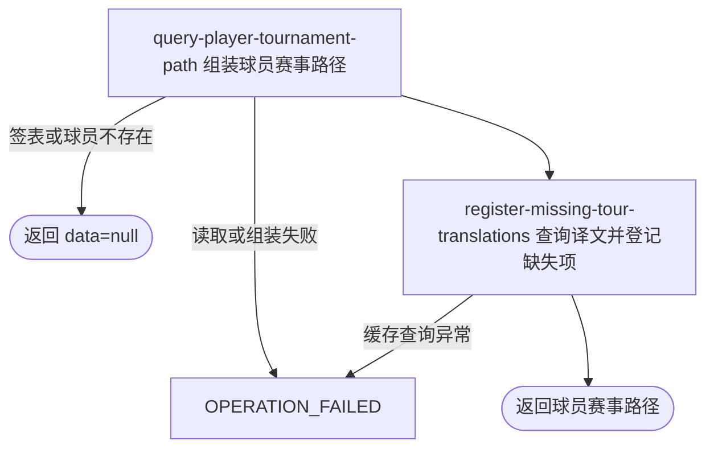

## 概要

查询一名球员在指定职业赛事签表中的晋级与潜在对阵路径。

## 触发

用户或匿名访问者要查看一名职业球员在某届赛事特定签表中的既有赛程与预测路径时发起。接口固定查询一个球员和一个签表，不分页。

## 接口契约

查询参数 `tournamentId`、`year`、`playerId`、`drawType` 均必须出现，其中 `year` 必须可转换为整数。字符串参数原样精确查询，不裁剪、不转换大小写，也不限制签表类型取值；接口不要求登录。

成功响应的 `data` 包含 `player`、`progressPath`、`eliminationInfo`、`next` 和 `upcomingOpponents`。签表或球员不存在时成功返回 `data=null`；球员没有比赛时仍返回球员主体，路径列表为空，出局信息与下一场为空。

## 业务活动

- query-player-tournament-path  读取签表、比赛与参赛资料并组装晋级、出局和潜在对阵路径
- register-missing-tour-translations  为简中缓存未命中的球员姓名与下一场球场登记待翻译项

## 流程图

## 详细流程

1. 接收必填的外部赛事编号 `tournamentId`、整数年份 `year`、外部球员编号 `playerId` 和签表类型 `drawType`。入口不要求登录，字符串不裁剪、不标准化，也不校验签表类型枚举。
2. 按赛事编号、年份和签表类型定位唯一签表；找不到时成功返回 `data=null`。再只按外部球员编号读取一名职业球员；找不到时同样返回 `data=null`。
3. 按签表内部编号与球员编号查种子资料，并读取该球员参与的全部比赛及签表全部比赛。对手姓名和国家/地区按外部球员编号批量补齐；对手种子则从同一外部赛事编号下的全部参赛资料合并取得，不隔离年份或签表。
4. 将所查球员的比赛按 `roundNumber` 升序排列，空轮次按 `0`；精确状态 `FINISHED` 且胜方为该球员的比赛进入晋级路径，其他完赛比赛作为败局，最后处理到的败局成为出局信息。
5. 完赛比分按来源盘数组顺序、以所查球员视角拼为逐盘局分；没有盘分时显示“已完成”。轮次保留来源简称并映射中文名，未知或空简称的中文名为空。
6. 只要存在一场 `FINISHED` 比赛且非该球员获胜，即判定已出局，不交付下一场和更远潜在对手。
7. 未出局时，优先取轮次排序后第一场非 `FINISHED` 且有签表位置的比赛作为当前比赛；另一方已确定时交付为 `next`。若没有未完成比赛，则取最后一场已获胜且有签表位置的比赛，从相邻签表子树选未淘汰且种子号最小的球员作为下一轮候选。`next` 排期依次采用计划时间、比赛日期、来源排期文本，再追加球场与场次序号；全部缺失时显示“待定”。
8. 从 `next` 之后继续按签表位置逐层向决赛推算，每层从对手子树选未淘汰的最高种子；没有种子候选时跳过该轮。缺少来源轮次时按二叉树位置推算 `F`、`SF`、`QF` 或 `R<n>`。
9. 组装主球员排名、积分、国家/地区、查询当天年龄与种子，并交付晋级路径、最后败局、下一场及后续候选。主球员姓名使用名和姓，对手只显示姓；资料缺失的对手回退显示外部球员编号。
10. 批量查询主球员及所有路径对手姓名、仅 `next` 球场的简中译文；命中时替换显示，其中球场译文只替换排期文本中的原名，`court` 字段仍为原文。未命中时保留原文并逐条尝试登记待翻译项。最终返回完整主体，不修改赛事、签表、球员或比赛资料。

## 异常分支

| 对外失败码 | 触发条件 | 由哪个活动报出 | 补偿动作或超时处理 | 对外提示 |
|---|---|---|---|---|
| `OPERATION_FAILED` | 任一必填参数缺失，或 `year` 无法转换为整数 | 流程入口参数绑定 | 未开始查询，不改变职业赛事或翻译数据 | 缺失参数无本入口专用提示；类型错误提示参数类型错误 |
| 无 | 指定赛事编号、年份、签表类型没有唯一签表，或球员编号没有唯一球员资料 | query-player-tournament-path | 成功返回 `data=null`，不登记待译项 | 无错误提示 |
| `OPERATION_FAILED` | 签表或球员查询因重复数据无法取得唯一记录，或比赛、参赛资料读取、路径/比分组装发生未处理异常 | query-player-tournament-path | 终止整体，不返回部分路径；职业赛事数据不变 | 系统异常，请稍后重试 |
| `OPERATION_FAILED` | 翻译缓存查询发生未处理异常 | register-missing-tour-translations | 终止整体；此前已登记的待译项不统一回滚 | 系统异常，请稍后重试 |

单条待译保存失败只记录日志并继续返回原文。球员没有比赛、参赛种子、对手资料、已知国家/地区、盘分、排期或球场时均按详细流程中的空值或降级展示成功返回，不作为查询失败。

## 技术线索

- HTTP：`GET /tour/player/tournament?tournamentId=...&year=...&playerId=...&drawType=...`，在普通鉴权排除清单中
- 入口：`TourPlayerQueryController.tournament()` → `PlayerTournamentQueryService.query()`
- 签表与比赛：`MatchQueryRepository.getDrawByTournamentIdAndType()`、`listByDrawIdAndPlayerId()`、`listByDrawId()`
- 球员与种子：`getPlayerById()`、`getSeedByDrawIdAndPlayerId()`、`listPlayersByPlayerIds()`、`listSeedsByTournamentIds()`
- 签表推算：`matchIndex` 二叉树；父节点为 `index / 2`，子节点为 `index * 2` 与 `index * 2 + 1`
- 翻译：`TourTranslationService.playerTournament()` / `TranslationQueryService.query()`，语言 `ZH_CN`
- 响应：`Result<PlayerTournamentVO>`
