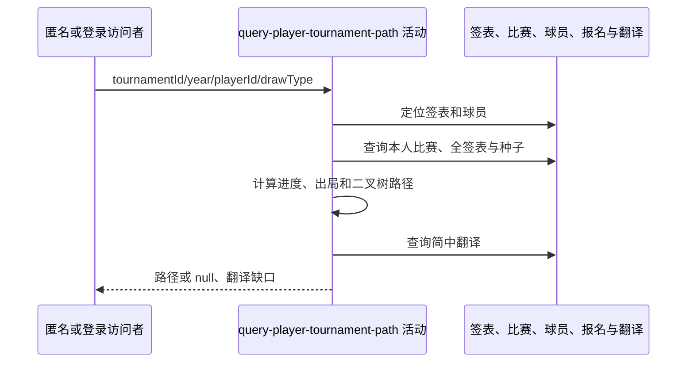

## 概要

读取指定签表、球员、比赛与参赛资料，组装晋级、出局、下一场和潜在对手路径。

## 时序图

## 触发条件

四个必填参数绑定成功后执行，接口匿名可用。

## 活动契约

字符串参数原样精确查询；签表或球员不存在成功返回 null。存在时返回主体、晋级路径、出局信息、下一场与后续候选，并输出翻译缺口。

## 异常分支

| 错误标识 | 触发条件 | 处理 |
|---|---|---|
| 空结果 | 唯一签表或球员不存在 | 成功返回 data=null |
| `OPERATION_FAILED` | 重复唯一数据、读取、路径/比分或翻译组装失败 | 终止整体，不返回部分路径 |

## 领域依赖

无

## 业务动作

A1 定位签表、球员和种子
A2 组装已完赛进度与出局信息
A3 计算下一场和潜在对手
A4 组装主体并应用翻译

## 详细流程

1. `A1` 按赛事编号+year+drawType 定位唯一签表，再仅按 playerId 定位球员；任一缺失返回 null。对手种子从同 tournamentId 全部报名合并，不隔离年份/签表。
2. 本人比赛按 roundNumber 升序，null 当0；FINISHED 且 winner=本人进入晋级路径，其他 FINISHED 为败局，最后处理败局成为出局信息。
3. 完赛比分按盘从本人视角拼接，无盘分显示“已完成”；任一败局即出局，不再给 next/候选。
4. `A3` 未出局时优先取排序首个非 FINISHED 且有 matchIndex 的当前比赛；对方已定则为 next。否则从最后胜局相邻子树选未淘汰最小种子。排期按 scheduledAt、matchDate、文本，再追加球场/序号，皆缺为“待定”。
5. 从 next 后沿 matchIndex 二叉树逐层选对手子树未淘汰最高种子；无种子候选跳过，缺轮次时按位置推算。
6. `A4` 主球员显示名+姓，对手优先姓、资料缺失回退 playerId；翻译主/对手姓名与 next 球场，球场译文只替换排期文本，court 字段保留原文。

## 边界情况

- 球员无比赛仍返回主体与空路径。
- 同 playerId 跨 ATP/WTA 重复可能使唯一查询失败。
- 对手种子跨年份/签表混合是当前实现限制。

## 实现提示

精确读列按 DB snapshot 声明；路径算法依赖 matchIndex 的二叉树含义。
